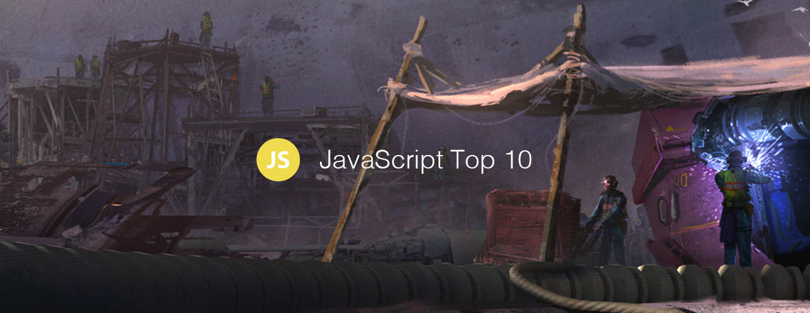

# JavaScript 十大文章（2018年12月版）

[返回首页](https://github.com/hijiangtao/javascript-articles-monthly)

## 清单

1. [JavaScript 是如何工作的：了解异步 JavaScript](https://blog.bitsrc.io/understanding-asynchronous-javascript-the-event-loop-74cd408419ff)
2. [用 JavaScript 尝试实现人脑-机器交互界面](https://medium.com/@devdevcharlie/experimenting-with-brain-computer-interfaces-in-javascript-8d6cb891fda8)
3. [超越 console.log(): 除 console.log 外更多调试 JavaScript 的方式](https://medium.com/@mattburgess/beyond-console-log-2400fdf4a9d8)
4. [Javascript 函数式编程原理](https://dev.to/leandrotk_/functional-programming-principles-in-javascript-26g7)
5. [如何避免复杂 JavaScript 应用的运行缓慢（2018 Chrome 开发者峰会）](https://www.youtube.com/watch?v=ipNW6lJHVEs)
6. [JavaScript 错误处理：权威指南](https://levelup.gitconnected.com/the-definite-guide-to-handling-errors-gracefully-in-javascript-58424d9c60e6)
7. [前端 JavaScript 面试题 2018/2019 版](https://blog.webf.zone/front-end-javascript-interviews-in-2018-19-e17b0b10514)
8. [作为一名 JavaScript 开发者，是什么让我在夜晚持续兴奋](https://www.toptal.com/javascript/es6-class-chaos-keeps-js-developer-up)
9. [JavaScript 异步模式快速指南](https://www.imaginarycloud.com/blog/asynch-javascript-patterns-guide)
10. [不为人知的 JavaScript 特性](https://blog.usejournal.com/little-known-features-of-javascript-901665291387)

我们明年再见！
