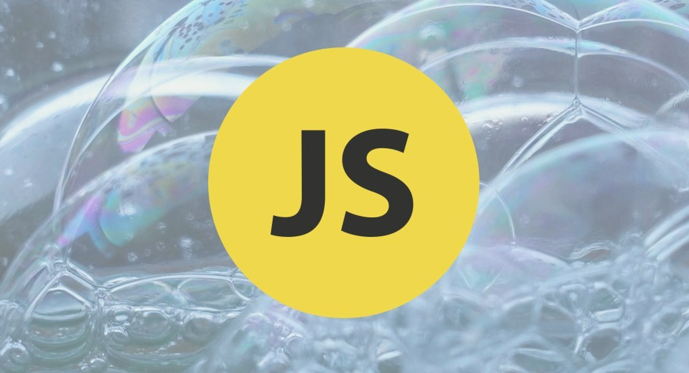

# JavaScript 月刊 / 2019年6月期

[返回首页](https://github.com/hijiangtao/javascript-articles-monthly)

在过去的一月里举办了几大技术大会，本期推荐 Keynote 速览，看看都有哪些有趣的新技术，详见周边视频列表。

## 清单

本期话题包含 WebAssembly、语言新特性、爬虫、Proxy、Promise、JavaScript 引擎、Vuejs、React、Serverless、Threejs、错误处理、开发者工具、Vim和代码规范。

* [WebAssembly 在 eBay 的真实应用剖析](https://www.ebayinc.com/stories/blogs/tech/webassembly-at-ebay-a-real-world-use-case/)
* [JavaScript 新特性概览](https://www.youtube.com/watch?v=c0oy0vQKEZE) - Google I/O
* [Node + Puppeteer 网页爬取指南](https://learnscraping.com/nodejs-web-scraping-with-puppeteer/)
* [Javascript Proxy 完全指南](https://blog.bitsrc.io/a-practical-guide-to-es6-proxy-229079c3c2f0)
* [关于 JavaScript 引擎你所需要知道的一切](https://www.valentinog.com/blog/engines/)
* [Nodejs Promise 的80/20定律指南](http://thecodebarbarian.com/the-80-20-guide-to-promises-in-node-js.html)
* [如果构建大型 Vuejs 项目](https://levelup.gitconnected.com/how-to-build-a-large-vue-application-3afa2aad4402)
* [如果利用 Nodejs Serverless 函数实现语音通话](https://www.twilio.com/blog/control-and-record-voice-messages-with-node-js-serverless-functions)
* [Three.js 基础教程](https://threejsfundamentals.org/threejs/lessons/threejs-fundamentals.html)
* [优雅的 JavaScript 错误处理](https://jrsinclair.com/articles/2019/elegant-error-handling-with-the-js-either-monad/)
* [借助 Nodejs 与 React 构建一个实时流应用](https://quantizd.com/building-live-streaming-app-with-node-js-and-react/)
* [利用 Firefox 开发者工具进行更快更智能的 JavaScript 调试](https://hacks.mozilla.org/2019/05/faster-smarter-javascript-debugging-in-firefox/)
* [为 JavaScript 开发者准备的 Vim 配置指南](https://freshman.tech/vim-javascript/)
* [编写简洁可扩展 JavaScript 代码的12点建议](https://blog.logrocket.com/12-tips-for-writing-clean-and-scalable-javascript-3ffe30abfe20/)

## 周边

Google I/O, F8, Build, 一起来看看技术大会上都有哪些新技术吧。

* [Node 12.3 发布，支持 WebAssembly Module](https://nodejs.org/en/blog/release/v12.3.0/)
* [pixi.js](https://github.com/pixijs/pixi.js) - 一款 HTML5 2D 渲染引擎
* [Visual Studio Code 开始支持远程开发](https://code.visualstudio.com/blogs/2019/05/02/remote-development)
* [AST Explorer](https://astexplorer.net/)
* [Google I/O Web 相关主题](https://www.youtube.com/playlist?list=PLNYkxOF6rcIATmAmz7HcCzongGvQEtx8i)
* 十分钟速览 [F8 Keynote](https://www.youtube.com/watch?v=UtxPdezclYw)
* 十分钟速览 [Google I/O Keynote](https://www.youtube.com/watch?v=wm2v6IpKXI4)
* 十分钟速览 [Build Keynote](https://www.youtube.com/watch?v=unPK61Hz3Rw)

*头图自 https://blog.logrocket.com/12-tips-for-writing-clean-and-scalable-javascript-3ffe30abfe20/*