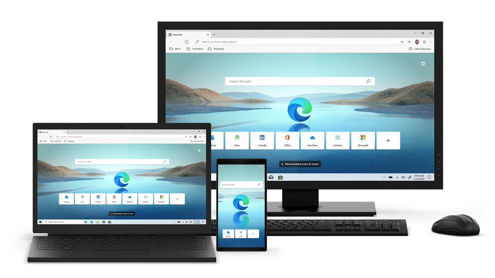

# 2020.2 / JavaScript 月刊 - 浏览器新气象

[返回首页](https://github.com/hijiangtao/javascript-articles-monthly)

2020年1月16日，此前测试已久的 Chromium 内核 Edge 浏览器稳定版本终于如期上线，至此微软的 Edge 浏览器已经基本完成了从 EdgeHTML 排版引擎到 Blink（Chromium）排版引擎之间的转换。全新 Microsoft Edge 浏览器支持 Windows 和 macOS 等操作系统，稳定版基本代表了微软对 Chromium Edge 的实际体验预期。欲知更多，可查看「动态」最后一条新闻。

## 清单

本期话题包含内存管理、开源库报告、ESLint、Tree Shaking、TDD、ECMAScript、年度报告、代码优化、TypeScript 和 JavaScript 教程等。

* [V8 引擎中内存管理的可视化](https://deepu.tech/memory-management-in-v8/)
* [一旦安装，JavaScript 库便几乎不再升级](https://blog.cloudflare.com/javascript-libraries-are-almost-never-updated/)
* [ESLint 配置与最佳指南](https://blog.geographer.fr/eslint-guide)
* [JavaScript Tree Shaking 进阶](https://medium.com/@bluepnume/javascript-tree-shaking-like-a-pro-7bf96e139eb7)
* [用 Karma 和 Webpack 助力高效测试驱动开发](https://bambooengineering.io/efficient-tdd-with-karma-and-webpack/)
* [ECMAScript 历年归档](https://www.ecma-international.org/archive/ecmascript/)
* [和干净的代码说声再见](https://overreacted.io/goodbye-clean-code/)
* [Storybook 2019年末状况报告](https://medium.com/storybookjs/state-of-storybook-2019-b6a91ac79b74)
* [拥抱 TypeScript - 项目迁移指南](https://www.twilio.com/blog/move-to-typescript)
* JavaScript Visualized 系列教程
    * [事件循环 / Event Loop](https://dev.to/lydiahallie/javascript-visualized-event-loop-3dif)
    * [提升机制 / Hoisting](https://dev.to/lydiahallie/javascript-visualized-hoisting-478h)
    * [作用域（链） / Scope (Chain)](https://dev.to/lydiahallie/javascript-visualized-scope-chain-13pd)
    * [原型继承 / Prototypal Inheritance](https://dev.to/lydiahallie/javascript-visualized-prototypal-inheritance-47co)
    * [生成器与迭代器 / Generators and Iterators](https://dev.to/lydiahallie/javascript-visualized-generators-and-iterators-e36)

## 动态

* [Yarn 2 发布](https://dev.to/arcanis/introducing-yarn-2-4eh1)
* [Node.js 13.7.0 发布](https://nodejs.org/en/blog/release/v13.7.0/)
* [Vue 3.0.0alpha.3 发布](https://github.com/vuejs/vue-next/releases/tag/v3.0.0-alpha.3)
* [Babel 7.8.0 发布](https://babeljs.io/blog/2020/01/11/7.8.0)
* [TypeScript 3.8 beta 发布](https://devblogs.microsoft.com/typescript/announcing-typescript-3-8-beta/)
* [基于 Chromium 的新版 Microsoft Edge 发布](https://blogs.windows.com/windowsexperience/2020/01/15/new-year-new-browser-the-new-microsoft-edge-is-out-of-preview-and-now-available-for-download/) ｜ [知乎讨论](https://www.zhihu.com/question/366521765)