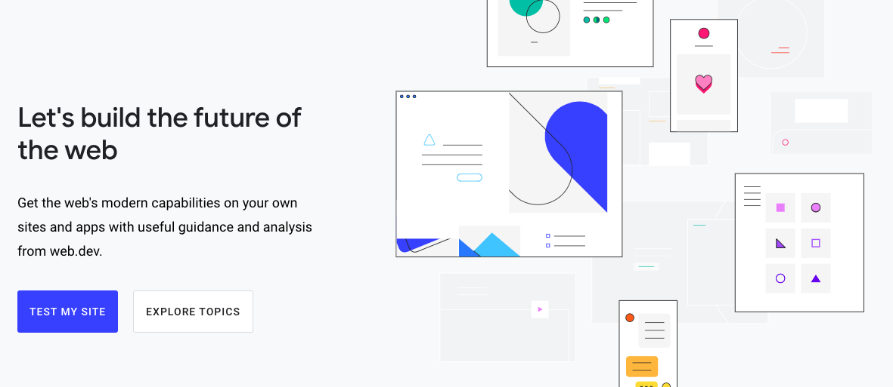

# 月刊 | JavaScript.2020.8 - V8 最新进展

[返回首页](https://github.com/hijiangtao/javascript-articles-monthly)

web.dev 每年都会举办开发者大会，用以介绍 Google 在 Web 上的最新进展冰河开发者交流。今年的大会由于疫情原因，改为线上举办。内容涵盖 DX、UX、AI、Web App、Performance、Testing、Streaming 等等，本期清单第一篇将 V8/JavaScript 最新进展列出，同时主题单独列出 web.dev playlist，感兴趣的同学可以戳链接观看。

1. [第一天播放列表](https://www.youtube.com/playlist?list=PLNYkxOF6rcIDC0-BiwSL52yQ0n9rNozaF)
1. [第二天播放列表](https://www.youtube.com/playlist?list=PLNYkxOF6rcIBhuGsbO6t8-OBE5-fVPe7K)
1. [第三天播放列表](https://www.youtube.com/playlist?list=PLNYkxOF6rcIDJHOcBzho38p6WTn3vESvQ)

## 清单

本期话题包含 V8、JavaScript 最新进展、TypeScript、webpack、Speculation、Node.js、ECMAScript、Web API、模版字符串、React、Vue 等。

* [V8/JavaScript 新鲜事概览](https://www.youtube.com/watch?v=TPm-UhWkiq8) - YouTube
* [Webpack 简要介绍](https://ui.dev/webpack/) - ui.dev
* [谈谈 TypeScript 类型检查的严格模式](https://www.carlrippon.com/controlling-type-checking-strictness-in-typescript/) - carlrippon.com
* [JavaScriptCore 中的推断编译（Speculation）](https://webkit.org/blog/10308/speculation-in-javascriptcore/) - webkit
* [如何在 Node.js 中启动一个子进程](https://www.digitalocean.com/community/tutorials/how-to-launch-child-processes-in-node-js) - DigitalOcean
* [来看看 JavaScript 语言规范中最新的 Stage-4 提案](https://dev.to/hemanth/stage-4-features-5a26) - dev
* [Temporal，一个替代 JavaScript 中的 Dates 与 Times 的未来 API](https://blogs.igalia.com/compilers/2020/06/23/dates-and-times-in-javascript/) - igalia
* [理解 JavaScript 中的模版字符串](https://www.taniarascia.com/understanding-template-literals/) - Tania
* [用 Tauri 和 Vue 开发一个迷你桌面应用](https://www.smashingmagazine.com/2020/07/tiny-desktop-apps-tauri-vuejs/) - smashing
* [在 React 中获取数据的四种方式](https://www.bitnative.com/2020/07/06/four-ways-to-fetch-data-in-react/) - Cory House

## 动态

* [V8 v8.5 发布](https://v8.dev/blog/v8-release-85)
* [TypeScript 4.0 Beta 发布](https://devblogs.microsoft.com/typescript/announcing-typescript-4-0-beta/)
* [Next.js 9.5 发布](https://nextjs.org/blog/next-9-5)
* [ESLint v7.4.0 发布](https://eslint.org/blog/2020/07/eslint-v7.4.0-released)
* [billboard.js 2.0 发布](https://medium.com/@alberto.park/billboard-js-2-0-is-out-15e84b52ab11)
* [Perf Track](https://perf-track.web.app/) - 系统级性能追踪框架
