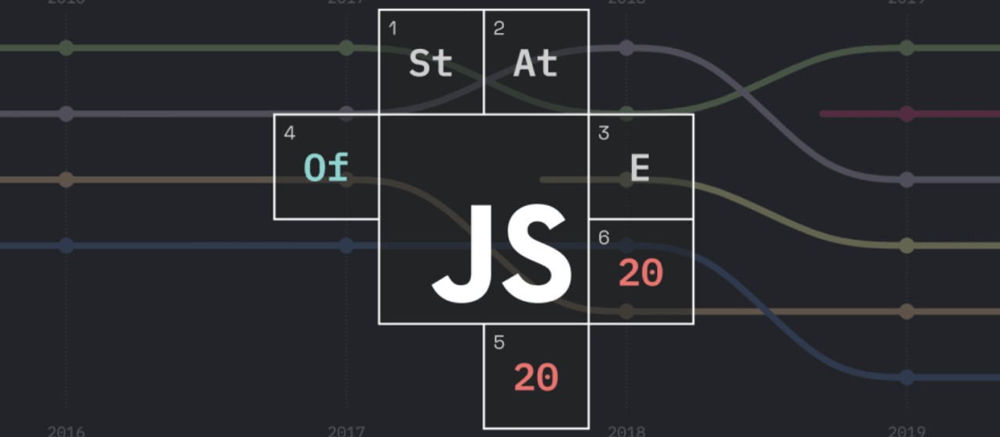

# 2021.2 / JavaScript 月刊 - 越来越好的 JavaScript 生态系统

[返回首页](https://github.com/hijiangtao/javascript-articles-monthly)

2020年，JavaScript 仍遵循着 ECMAScript 的迭代节奏向前发展。得益于像可选链 (Optional Chaining) 和空值合并运算符 (Nullish Coalescing) 这样的新特性，语言本身在不断改进，而 TypeScript 的广泛使用将静态类型化普及到了一个新的高度。

在框架方面，就在我们以为一切都已经稳定下来的时候，Svelte 的出现以一种全新的方式撼动了前端的一切。甚至连构建工具在经历了多年的 webpack 统治之后，也出现了新的趋势。

本期将推荐大家查看《JavaScript 2020现状调查》，详见清单第一条，以此跟进这个不断变得更好的生态系统。

与此同时，本期清单第二条通过比较各项目在过去12个月里在 GitHub 上的 star 增量，以此罗列了一些2020年备受瞩目的那些 JavaScript 项目。

## 清单

本期话题包含 JavaScript 年度报告、项目汇总、Puppeteer、TypeScript、ECMAScript、Deno、内存泄漏、应用构建等。

* [JavaScript 2020现状调查](https://2020.stateofjs.com/en-US/) - stateofjs.com
* [JavaScript 2020后起之秀](https://risingstars.js.org/2020/en) - bestofjs
* [将 Puppeteer 迁移到 TypeScript](https://developers.google.com/web/updates/2021/01/puppeteer-typescript) - Google Web Updates
* [如何在 TypeScript 中利用函数重载来弃用函数签名](https://altrim.io/posts/deprecating-function-signature-in-typescript) - altrim.ios
* [今年要改正的10种 TypeScript 不良习惯](https://startup-cto.net/10-bad-typescript-habits-to-break-this-year/) - startup-cto.net 
* [利用 TypeScript API 找出藏在代码中的问题](https://davidgomes.com/using-the-typescript-api-to-find-issues-in-your-code/) - David
* [ECMAScript 2020 最终特性合辑](https://2ality.com/2019/12/ecmascript-2020.html) -  2ality.com
* [Deno 速览](https://www.youtube.com/watch?v=puXyo1jGQys) - YouTube
* [修复 Web 应用内存泄漏](https://nolanlawson.com/2020/02/19/fixing-memory-leaks-in-web-applications/) - noianlawson.com 
* [如何在2021年构建 JavaScript 应用](https://timdaub.github.io/2021/01/16/web-principles/) - TIM

## 动态

* [TypeScript 4.2 beta 发布](https://devblogs.microsoft.com/typescript/announcing-typescript-4-2-beta/)
* [Snowpack v3.0 发布](https://www.snowpack.dev/posts/2021-01-13-snowpack-3-0)
* [TOAST UI 4.0 发布](https://ui.toast.com/weekly-pick/en_20210126)
* [Deno 1.7 发布](https://deno.land/posts/v1.7)
* [JerryScript](https://github.com/jerryscript-project/jerryscript) - 物联网时代的 JavaScript 引擎
