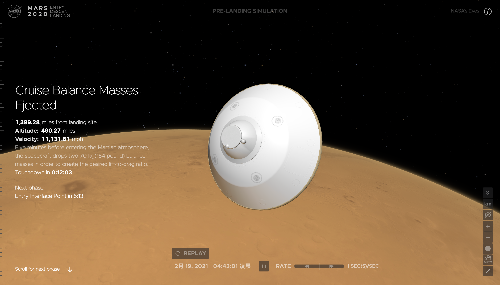

# 2021.3 / JavaScript 月刊 - 数据可视化的开源十年

[返回首页](https://github.com/hijiangtao/javascript-articles-monthly)

本期主题故事推荐阅读 Mike Bostock 写的《数据可视化的开源十年》，Mike 是 D3 的作者，其可视化库的想法最初源于其在纽约时报工作时期。十年过去，如今 D3 已成为社区最被认可的数据可视化开源方案之一，无数的可视化方案基于其发展而来，关于这篇文章，详见清单第一条链接。

此外，作为另一久负盛名的可视化库 three.js, 作者在 Twitter 上表示 NASA 正使用 three.js 实时模拟美国宇航局在火星上的着陆情况，推文见 <https://twitter.com/mrdoob/status/1362508150507790343>，NASA 站点见 <https://eyes.nasa.gov/apps/mars2020/>。

- D3.js GitHub <https://github.com/d3/d3>
- three.js GitHub <https://github.com/mrdoob/three.js>
- Data Visualization Wiki <https://en.wikipedia.org/wiki/Data_visualization>

## 清单

本期话题包含数据可视化库、Streams API、JavaScript 性能分析、开发者访谈、V8、函数重载实践、GitHub 改版、函数用法实践、TypeScript、Angular、RxJS、npm 等。

* [数据可视化库 D3.js 的开源十年](https://observablehq.com/@mbostock/10-years-of-open-source-visualization) - observablehq.com
* [Streams API 权威指南](https://web.dev/streams/) - web.dev
* [JavaScript 性能影响探究 - Bundle 大小及更多](https://nolanlawson.com/2021/02/23/javascript-performance-beyond-bundle-size/) - Nolan
* [与 Ryan Dahl 的访谈纪实](https://evrone.com/ryan-dahl-interview) - evrone
* [超级快速的 super 属性访问](https://v8.dev/blog/fast-super) - v8.dev
* [进行大量函数重载的 WHY & HOW](https://lea.verou.me/2021/02/mass-function-overloading-why-and-how/) - 
* [更快速敏捷的 GitHub 新主页](https://github.blog/2021-01-29-making-githubs-new-homepage-fast-and-performant/) - GitHub
* [除非设计如此，否则不要将函数用于回调场景](https://jakearchibald.com/2021/function-callback-risks/) - Jake
* [利用 TypeScript 的泛型构建类型未知的缓存](https://indepth.dev/posts/1334/building-a-type-agnostic-cache-using-generics-in-typescript) - indepth.devsindepth.devs
* [如何重构 Angular 代码](https://indepth.dev/posts/1425/how-to-refactor-an-angular-codebase) - indepth.dev
* [RxJS 自定义运算符](https://indepth.dev/posts/1421/rxjs-custom-operators) - indepth.dev
* [为什么在 RxJS 中使用 Subject 会内存泄漏](https://indepth.dev/posts/1433/rxjs-why-memory-leaks-occur-when-using-a-subject) - indepth.dev
* [npm v7 中 Lockfile 文件变更一览](https://nitayneeman.com/posts/catching-up-with-package-lockfile-changes-in-npm-v7/) - Nitay Neeman's Blog

## 动态

* [TypeScript 4.2 发布](https://devblogs.microsoft.com/typescript/announcing-typescript-4-2/)
* [Vite 2.0 发布](https://dev.to/yyx990803/announcing-vite-2-0-2f0a)
* [Remotion](https://github.com/JonnyBurger/remotion) - 一个用 React 为应用创建视频的开源库
* [homebrew 3.0 发布](https://brew.sh/2021/02/05/homebrew-3.0.0/)
* [@humanwhocodes/env - 更好的 JavaScript 环境变量读取方案](https://humanwhocodes.com/blog/2021/02/introducing-env-javascript-environment-variables/)
* [Node.js 15.9.0 发布](https://nodejs.org/en/blog/release/v15.9.0/)
* [WebdriverIO v7 发布](https://webdriver.io/blog/2021/02/09/webdriverio-v7-released/)
