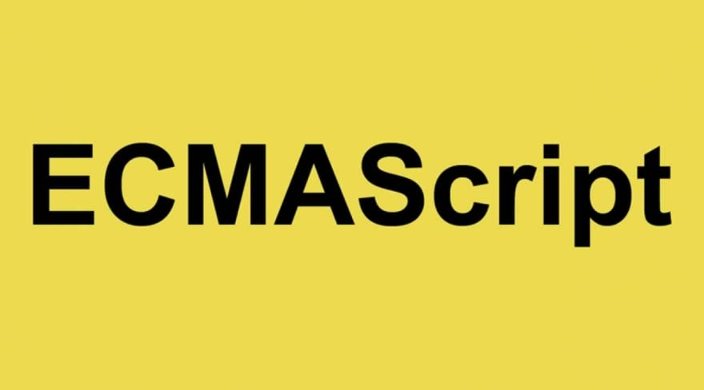

# 2021.7 / JavaScript 月刊 - ES2021 定稿

ES2021已于近日定稿，查看清单第一条可以了解更多详情。

[返回首页](https://github.com/hijiangtao/javascript-articles-monthly)

## 清单

本期话题包含 ES2021、语言解析原理、JAvaScript 内存测试、React 规划、WebAssembly、webpack、ECMAScript 特性、Node.js、Vue3、Node.js 库等。

* [ES2021 定稿，特性速览](https://h3manth.com/ES2021/) - h3manth.com
* [解析 JavaScript 所需要的工具与库](https://tomassetti.me/parsing-in-javascript/) - Gabriele Tomassetti
* [JavaScript 内存使用情况基准测试](https://blog.webpagetest.org/posts/benchmarking-javascript-memory-usage/) - Tim
* [React 18 规划](https://reactjs.org/blog/2021/06/08/the-plan-for-react-18.html) - reactjs.org
* [利用 WebAssembly 让你的 JavaScript 代码飞速运行](https://bytecodealliance.org/articles/making-javascript-run-fast-on-webassembly) - BYTECODE
* [webpack 入门指南](https://www.smashingmagazine.com/2021/06/getting-started-webpack/) - smashingmagazine.com
* [JavaScript 可选链更多不为人知的特性](https://swizec.com/blog/a-surprising-feature-of-javascript-optional-chaining/) - swizec.com
* [NodeJS Stream 使用指南](https://blog.insiderattack.net/a-visual-guide-to-nodejs-streams-9d2d594a9bf5) - insiderattack.net
* [在 Vue 3 中管理共享状态](https://www.smashingmagazine.com/2021/06/managing-shared-state-vue3/) - smashingmagazine.com
* [libSquoosh 介绍](https://web.dev/introducing-libsquoosh/) - web.dev

## 动态

* [Storybook v6.3 发布](https://storybook.js.org/blog/storybook-6-3/)
* [next.js v11.0 发布](https://nextjs.org/blog/next-11)
* [ws v7.5.0 发布](https://github.com/websockets/ws)
* [Deno v1.11 发布](https://deno.com/blog/v1.11)
* [Node v16.3.0 发布](https://nodejs.org/en/blog/release/v16.3.0/)
* [Electron v13.0.0 发布](https://www.electronjs.org/blog/electron-13-0)
