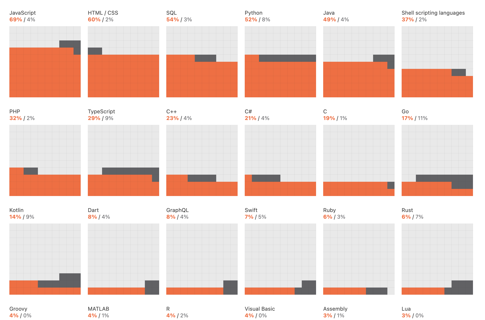

# 2021.8 / JavaScript 月刊 - 开发者生态系统现状报告

想必大家对 Jetbrains 都不陌生，作为程序员，我们中很大一部分群体在每天的工作中都会使用他们的产品。就在半个月前，基于 183 个国家和地区的 31,743 位开发者的回复，Jetbrains 发布了《2021 开发者生态系统现状报告》，其中有不少有趣的数据，比如：

1. JavaScript 是最受欢迎的语言 – 69% 的受访者在过去 12 个月中使用过它，而 39% 的受访者将其指定为他们的主要编程语言。
2. 就整体使用情况而言，Python 比 Java 更受欢迎（52% 对 49%），而作为一种主要语言，Java 比 Python 更受欢迎（32% 对 29%）。
3. 增长最快的 5 种语言是 Python、TypeScript、Kotlin、SQL 和 Go。
4. 越来越多的女性开发者进入科技行业 – 女性更有可能参与数据分析和机器学习或者 UX/UI 设计/研究，但不太可能从事基础架构开发/DevOps、系统管理或部署方面的工作。
5. ……

更多详情可查看清单中最后一条链接。

[返回首页](https://github.com/hijiangtao/javascript-articles-monthly)

## 清单

本期话题包含调试技巧、Yarn、性能分析、Web Worker、Node.js API、工作线程、JavaScript 历史、开发者调查等。

* [在 Visual Studio Code 中用 console.log 调试](https://christianheilmann.com/2021/07/30/using-console-log-debugging-in-visual-studio-code/) - Christian Heilmann
* [来看看 Yarn 3.0 都有哪些新特性](https://dev.to/arcanis/yarn-3-0-performances-esbuild-better-patches-e07) - dev.to
* [Chrome 插件是如何影响浏览器性能的](https://www.debugbear.com/blog/chrome-extension-performance-2021) - debugbear.com
* [利用 Visual Studio Code 的开发者工具更轻松地调试](https://blogs.windows.com/msedgedev/2021/07/16/easier-debugging-developer-tools-in-visual-studio-code/) - blog.windows.com
* [Web Worker 2021现状调查](https://www.smashingmagazine.com/2021/06/web-workers-2021/) - Surma
* [`export default thing` 与 `export { thing as default }` 的区别](https://jakearchibald.com/2021/export-default-thing-vs-thing-as-default/) - Jake
* [Node.js 工作线程简介](https://yarin.dev/nodejs-cpu-bound-tasks-worker-threads/) - yarin.dev
* [async_hooks 使用场景介绍](https://nodejs.medium.com/what-use-cases-exist-for-async-hooks-6eab74d7eefd) - medium.com
* [JavaScript 的头一个20年](https://dl.acm.org/doi/pdf/10.1145/3386327) - dl.acm.org
* [2021 开发者生态系统现状报告](https://www.jetbrains.com/lp/devecosystem-2021/) - jetbrains.com

## 动态

* [node.js v16.6.0 发布](https://nodejs.org/en/blog/release/v16.6.0/)
* [ws v8.0.0 发布](https://github.com/websockets/ws/releases/tag/8.0.0)
* [date-fns v2.23.0 发布](https://github.com/date-fns/date-fns/releases)
* [Recoil v0.4.0 发布](https://github.com/facebookexperimental/Recoil/releases/tag/0.4.0)
* [V8 v9.2.0 发布](https://v8.dev/blog/v8-release-92)
* [Deno v1.12.0 发布](https://deno.com/blog/v1.12)
* [Snowpack v3.8.3 发布](https://github.com/snowpackjs/snowpack/releases)
* [rollup v2.55.1 发布](https://github.com/rollup/rollup/releases)
