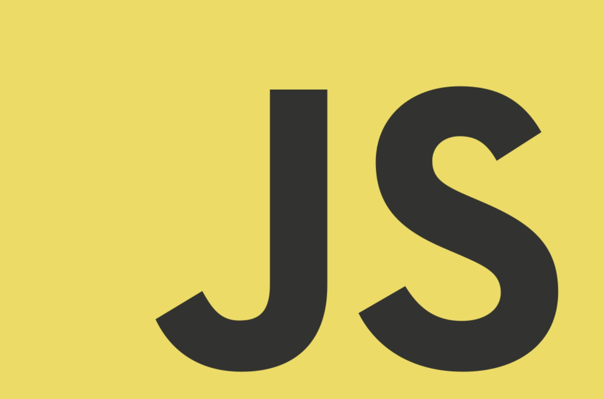

# 2021.10 / JavaScript 月刊 - JS Logo 发布十年啦

十年前在 JSConf EU 2011 上，用 “JS” 字母 代表 JavaScript 的社区 logo 正式发布。起初，其被用于标注 JS 项目，在 MIT 协议下，如果你愿意你也可以随意的使用它，而不用担心相关版权、税与授权许可等麻烦。详情见 <https://github.com/voodootikigod/logo.js>

[返回首页](https://github.com/hijiangtao/javascript-articles-monthly)

## 清单

本期话题包含 Web Worker、JavaScript 实现、JavaScript 引擎、MediaStream API、构建优化、JSON 数据库、资源打包、Paint API、正则表达式、NPM 错误提示、React 组件、VS Code 快捷方式、加载耗时优化、框架学习、RxJS、webpack、交互追踪、Angular 架构设计、微前端、样式技巧、Buffer polyfill、日志实现等。

本期文章清单较长，感谢关注与阅读。

* [Partytown 闪亮登场：让你在 Web Worker 中运行三方脚本](https://dev.to/adamdbradley/introducing-partytown-run-third-party-scripts-from-a-web-worker-2cnp) - dev.to
* [剖析除 V8 外其余40+的 JavaScript 运行实现](https://notes.eatonphil.com/javascript-implementations.html) - Phil Eaton
* [ChowJS：一个为游戏机设计的 AOT JavaScript 引擎](https://mp2.dk/techblog/chowjs/) - mp2.dk
* [如何使用 MediaStream API 录制音频](https://www.sitepoint.com/mediastream-api-record-audio/) - Shahed Nasser
* [更小的 bundle、更快的页面：面对大体积的 JavaScript 我们该如何应对](https://calibreapp.com/blog/bundle-size-optimization) - Ben Schwarz
* [lowdb - 简单易用的本地 JSON 数据库](https://github.com/typicode/lowdb) - GitHub
* [非 JavaScript 资源打包](https://web.dev/bundling-non-js-resources/) - web.dev
* [CSS Paint API 探索：blob 动画](https://css-tricks.com/exploring-the-css-paint-api-blob-animation/) - css-tricks
* [在 JavaScript 中使用正则表达式需要关注的威胁](https://blog.bitsrc.io/threats-of-using-regular-expressions-in-javascript-28ddccf5224c) - Dulanka Karunasena
* [每个开发者都该避免的常见 NPM 错误](https://blog.bitsrc.io/common-npm-mistakes-every-developer-should-avoid-60ab0642d8f9) - Bhagya Vithana
* [React 中受控组件与非受控组件对比](https://blog.logrocket.com/controlled-vs-uncontrolled-components-in-react/) - LogRocket
* [最能提高工作效率的 Visual Studio Code 快捷方式汇总](https://dev.to/myogeshchavan97/most-useful-visual-studio-code-shortcuts-to-improve-your-productivity-2kh4) - dev.to
* [如何将 React 应用程序加载时间降低70%](https://dev.to/nilanth/how-to-reduce-react-app-loading-time-by-70-1kmm) - dev.to
* [如何高效地学习 React](https://dev.to/shaan_alam/how-to-learn-react-the-effective-way-2km7) - dev.to
* [探索 RxJS：感受响应式系统的魅力](https://indepth.dev/posts/1481/rxjs-telegraph) - indepth.dev
* [深入探索 webpack 打包过程](https://indepth.dev/posts/1482/an-in-depth-perspective-on-webpacks-bundling-process) - indepth.dev
* [追踪用户交互区域](https://indepth.dev/posts/1479/tracking-user-interaction-area) - indepth.dev
* [Angular 架构设计：容器与展示分离模式](https://indepth.dev/posts/1478/designing-angular-architecture-container-presentation-pattern) - indepth.dev
* [更复杂的微前端架构设计分享](https://indepth.dev/posts/1477/taking-micro-frontends-to-the-next-level) - indepth.dev
* [利用 `accent-color` 简化表单样式](https://www.smashingmagazine.com/2021/09/simplifying-form-styles-accent-color/) - Michelle
* [最后一次自定义单选按与复选框样式](https://www.scottohara.me/blog/2021/09/24/custom-radio-checkbox-again.html) - scottaohara
* [利用 Webpack 5 对 Buffer 进行 polyfill](https://levelup.gitconnected.com/how-to-polyfill-buffer-with-webpack-5-1b6559ab87b8) - medium
* [利用 Pino-logger 在 Node.js 应用中记录日志](https://css-tricks.com/how-to-implement-logging-in-a-node-js-application-with-pino-logger/) - css-tricks

## 动态

* [GATSBY 4 beta 版本发布](https://www.gatsbyjs.com/gatsby-4/)
* [Deno v1.14 发布](https://deno.com/blog/v1.14)
* [Node v16.9.1 发布](https://nodejs.org/en/blog/release/v16.9.1/)
* [Prettier v2.4 发布](https://prettier.io/blog/2021/09/09/2.4.0.html)
* [Electron 14.0.0 发布 发布](https://www.electronjs.org/blog/electron-14-0/)
* [nvm-windows v1.1.8 发布](https://github.com/coreybutler/nvm-windows/releases)
