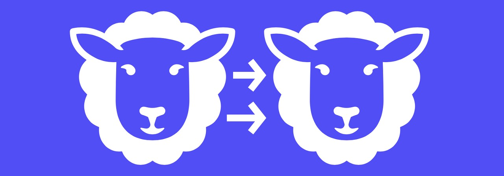

# 2022.01 / JavaScript 月刊

[返回首页](https://github.com/hijiangtao/javascript-articles-monthly)

## 清单

本期话题包含 Angular、JSON、狗UI教案工具、Svelte、React、Web API、代码瘦身、装饰器、WebAssembly 等。

* [谢谢你，Angular](https://blog.angular.io/thank-you-angular-d90d70f2e9d8) - Angular.io
* [JavaScript JSON 模块介绍](https://dmitripavlutin.com/javascript-json-modules/) - Dmitri Pavlutin
* [JavaScript trim 操作介绍](https://dmitripavlutin.com/javascript-string-trim/) - Dmitri Pavlutin
* [新一代构建工具对比](https://css-tricks.com/comparing-the-new-generation-of-build-tools/) - css tricks
* [Svelte 与 React 对比](https://www.jackfranklin.co.uk/blog/comparing-svelte-and-react-javascript/) - jackfranklin
* [React Conf 2021 回顾](https://reactjs.org/blog/2021/12/17/react-conf-2021-recap.html) - reactjs.org
* [使用 `structuredClone` API 实现 JavaScript 中的深拷贝](https://web.dev/structured-clone/) - web.dev
* [我们是如何使用 Qwik + Partytown 给我们的 JavaScript 代码瘦身99%的](https://www.builder.io/blog/how-we-cut-99-percent-js-with-qwik-and-partytown) - builder
* [通过 JavaScript 装饰器来给代码附加新能力](https://indepth.dev/posts/1491/attaching-new-behaviors-through-decorators-in-javascript) - indepth.dev
* [WebAssembly 组件模型介绍](https://radu-matei.com/blog/intro-wasm-components/) - Radu Matei

## 动态

* [Node v17.2.0 发布](https://nodejs.org/en/blog/release/v17.2.0/)
* [npm v8.2.0 发布](https://github.com/npm/cli/releases/tag/v8.2.0)
* [Node v17.2.0 发布](https://nodejs.org/en/blog/release/v17.2.0/)
* [Deno v1.17 发布](https://deno.com/blog/v1.17)
* [Preact v10.6.4 发布](https://github.com/preactjs/preact/releases/tag/10.6.4)
