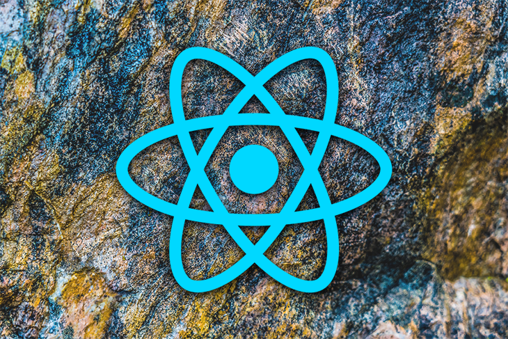

# 2022.04 / JavaScript 月刊 - React v18 来啦

[返回首页](https://github.com/hijiangtao/javascript-articles-monthly)

## 清单

本期话题包含 React、ECMAScript、关键渲染路径、最佳实践、应用设计、Chrome、布局算法、HTML、webkit 等。

* [React v18 来啦](https://reactjs.org/blog/2022/03/29/react-v18.html) - reactjs.org
* [ECMAScript 提案：类型标注](https://github.com/tc39/proposal-type-annotations) - tc39
* [5种不需要 JavaScript 的场景](https://lexoral.com/blog/you-dont-need-js/) - lexoral.com
* [详解 Javascript 关键渲染路径](https://indepth.dev/posts/1498/101-javascript-critical-rendering-path) - indepth.dev
* [React 代码简洁之道](https://javascript.plainenglish.io/clean-up-your-react-js-code-fd6dc54dcde) - javascript.plainenglish.io
* [面向对象 React 应用设计](https://blog.bitsrc.io/an-object-oriented-react-app-design-6242c168fcf8) - bitsrc.io
* [Chrome 来到了第100个版本](https://www.theverge.com/2022/3/30/23002780/chrome-browser-version-100-features) - theverge.com
* [理解布局算法](https://www.joshwcomeau.com/css/understanding-layout-algorithms/) - joshwcomeau.com
* [那些你永远不会用到的 HTML 属性](https://www.smashingmagazine.com/2022/03/html-attributes-you-never-use/) - smashingmagazine.com
* [Safari 15.4 中的 webkit 新特性](https://webkit.org/blog/12445/new-webkit-features-in-safari-15-4/) - webkit.org

## 动态

* [Parcel v2.4.0](https://parceljs.org/blog/v2-4-0/)
* [Node v17.8.0](https://nodejs.org/en/blog/release/v17.8.0/)
* [Pixi.js v6.3.0](https://github.com/pixijs/pixijs/releases/tag/v6.3.0)
* [Prettier v2.6.0](https://prettier.io/blog/2022/03/16/2.6.0.html)
* [Deno v1.20](https://deno.com/blog/v1.20)
* [Angular v13.3.0](https://github.com/angular/angular/releases/tag/13.3.0)
* [TypeScript v4.6.0](https://devblogs.microsoft.com/typescript/announcing-typescript-4-6/)
* [Ember v4.2](https://blog.emberjs.com/ember-4-2-released/)
