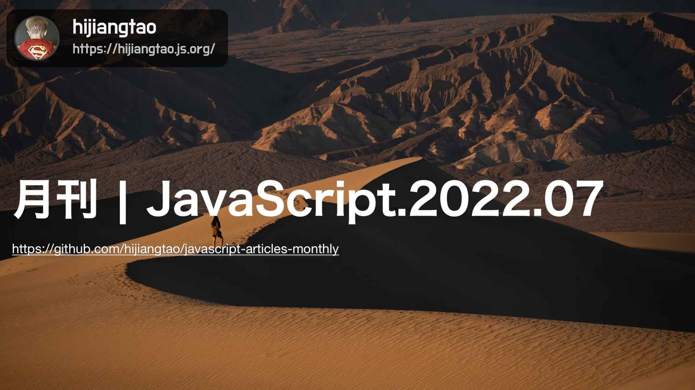

# 2022.07 / JavaScript 月刊

[返回首页](https://github.com/hijiangtao/javascript-articles-monthly)

## 清单

本期话题包含 React、Map、块语句、AbortController、JavaScript 用法、Angular、Monorepo、游戏开发、打包工具、配置等。

* [当下，React 团队正在做什么](https://reactjs.org/blog/2022/06/15/react-labs-what-we-have-been-working-on-june-2022.html) - reactjs.org
* [在 JavaScript 中什么时候该用 Map 而不是 Object](https://www.zhenghao.io/posts/object-vs-map) - zhenghao.io
* [使用块语句为变量创建本地作用域](https://gist.github.com/getify/712d994419326b53cabe20138161908b) - getify
* [AbortController 用法简介](https://whistlr.info/2022/abortcontroller-is-your-friend/) - samthor
* [用 JavaScript 来解释一些数学符号](https://runjs.app/blog/mathematical-notation-for-javascript-developers-explained) - runjs
* [Angular v14 介绍](https://blog.angular.io/angular-v14-is-now-available-391a6db736af) - angular.io
* [详细说说 JavaScript 与 TypeScript 中的 Monorepo](https://www.robinwieruch.de/javascript-monorepos/) - robin
* [用 Word 软件和 Javascript 制作一款游戏](https://www.youtube.com/watch?v=ZbirrsL0gSQ&ab_channel=SethEric) - YouTube
* [你的 NPM 库可能并不需要一个打包工具](https://cmdcolin.github.io/posts/2022-05-27-youmaynotneedabundler) -
* [谈谈 Angular 中的外部配置](https://indepth.dev/posts/1502/external-configurations-in-angular) - indepth.dev

## 动态

* [Angular eslint v14.0.0 发布](https://github.com/angular-eslint/angular-eslint/releases/tag/v14.0.0)
* [React Native 0.69 发布](https://reactnative.dev/blog/2022/06/21/version-069)
* [Gatsby v4.17 发布](https://www.gatsbyjs.com/docs/reference/release-notes/v4.17/)
* [Prettier 2.7 发布](https://prettier.io/blog/2022/06/14/2.7.0.html)
* [ember.js v4.5.0 发布](https://github.com/emberjs/ember.js/releases/tag/v4.5.0)
* [Node v18.4.0 发布](https://nodejs.org/en/blog/release/v18.4.0/)
* [puppeteer v15.3.0 发布](https://github.com/puppeteer/puppeteer/releases)
* [Jasmine 4.2.0 发布](https://github.com/jasmine/jasmine/blob/main/release_notes/4.2.0.md)
* [lint-staged v13.0.3 发布](https://github.com/okonet/lint-staged/releases)
