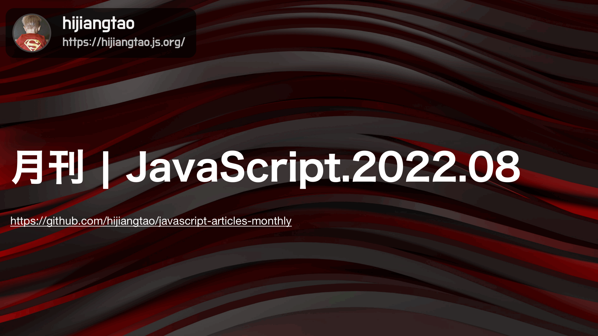

# 2022.08 / JavaScript 月刊 - ES2022 来了

[返回首页](https://github.com/hijiangtao/javascript-articles-monthly)

ES2022 已发布，详情可参考 ECMAScript 标准文档，或者跟随清单第一篇文章一探究竟。

## 清单

本期话题包含 ES2022、干净架构、开发者实践、JavaScript 代码瘦身、SOLID 实践、JavaScript 运行时、前端优化、OpenJS、XMLHttpRequest、Node.js API 等。

* [ES2022 新特性与代码示例速览](https://h3manth.com/ES2022/) - H3manth
* [干净架构：React 上手实例](https://dev.to/rubemfsv/clean-architecture-applying-with-react-40h6) - dev.to
* [开发者最容易遇到的10个 JavaScript 问题](https://www.toptal.com/javascript/10-most-common-javascript-mistakes) - Toptal
* [JavaScript SDK 过于庞大，于是我们瘦身了29%](https://blog.sentry.io/2022/07/19/javascript-sdk-package-reduced) - Sentry
* [将 SOLID 原则应用在 React 项目中](https://konstantinlebedev.com/solid-in-react/) - Konstantin Lebedev
* [Bun：一款崭新的 JavaScript 运行时环境](https://bun.sh/) - Bun.sh
* [如何不阻塞浏览器：重要部分讲解](https://medium.com/@matthew.costello/frontend-web-performance-the-essentials-1-cb6513e1c3a1) - Matthew Costello
* [OpenJS World 2022 亮点回顾](https://nodesource.com/blog/takeaways-OpenJSWorld22) - NodeSource
* [XMLHttpRequest 重试策略思考](https://lofi.limo/blog/retry-xmlhttprequest-carefully) - lofi.limo
* [Node.js 文件系统详解](https://2ality.com/2022/06/nodejs-file-system.html) - 2ality

## 动态

* [ESLint v8.20.0 发布](https://eslint.org/blog/2022/07/eslint-v8.20.0-released/)
* [Angular v14.1.0 发布](https://github.com/angular/angular/releases/tag/14.1.0)
* [Vue v2.7.8 发布](https://github.com/vuejs/vue/blob/main/CHANGELOG.md)
* [Vite 3.0 发布](https://vitejs.dev/blog/announcing-vite3.html)
* [preact 10.10.0 发布](https://github.com/preactjs/preact/releases)
* [Ember 4.5 发布](https://blog.emberjs.com/ember-4-5-released/)
* [puppeteer v15.2.0 发布](https://github.com/puppeteer/puppeteer/releases/tag/v15.2.0)
* [next.js v12.2.0 发布](https://github.com/vercel/next.js/releases/tag/v12.2.0)
* [deck.gl v8.8.6 发布](https://github.com/visgl/deck.gl/releases)