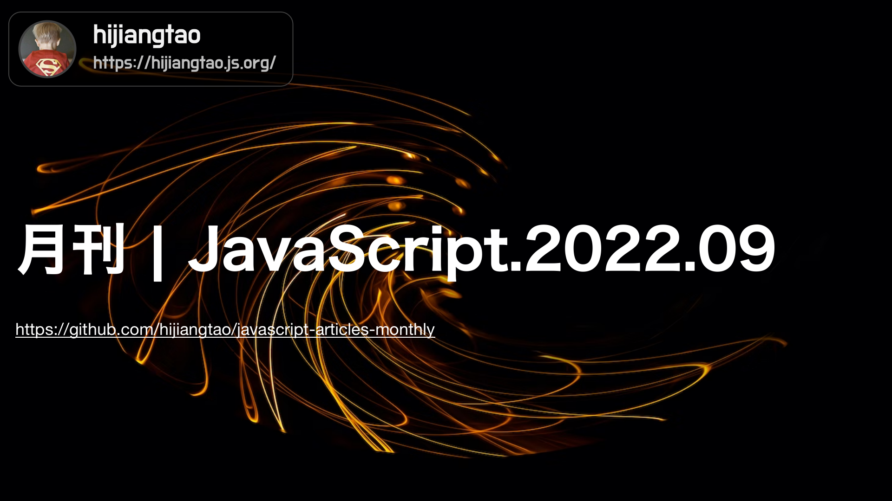

# 2022.09 / JavaScript 月刊

[返回首页](https://github.com/hijiangtao/javascript-articles-monthly)

## 清单

本期话题包含网页抓取库、JavaScript 未来特性、开发模式、jQuery、Node.js 多线程、代码优化、Three.js、React、VueConf US 2022、Node.js bin 脚本等。

* [Crawlee: 网页抓取与浏览器自动化库](https://blog.apify.com/announcing-crawlee-the-web-scraping-and-browser-automation-library/) - Crawlee
* [JavaScript 未来特性探究](https://portal.gitnation.org/contents/future-features-of-js) - JSNation 2022
* [Patterns.dev: 现代 Web App 开发模式](https://www.patterns.dev/) - patterns.dev
* [为什么我们要将 GOV.UK 上的 jQuery 移除以及我们是怎么做的](https://insidegovuk.blog.gov.uk/2022/08/11/how-and-why-we-removed-jquery-from-gov-uk/) - gov.uk
* [如何在 Node.js 中使用多线程](https://www.digitalocean.com/community/tutorials/how-to-use-multithreading-in-node-js) - digitalocean
* [如何缩小 JavaScript 代码的编程技巧](https://getbutterfly.com/code-golfing-tips-tricks-how-to-minify-your-javascript-code/) - Ciprian
* [使用 Three.js 对稳定流体进行建模](https://mofu-dev.com/en/blog/stable-fluids/) - mofu-dev.com
* [React re-render 一探究竟](https://www.joshwcomeau.com/react/why-react-re-renders/) - joshwcomeau.com
* [我在 VueConf US 2022 上的经验演讲](https://austingil.com/vueconf-us-2022-review/) - austingil.com
* [安装与运行 Node.js bin 脚本](https://2ality.com/2022/08/installing-nodejs-bin-scripts.html) - 2ality.com

## 动态

* [TypeScript 4.8 发布](https://devblogs.microsoft.com/typescript/announcing-typescript-4-8/)
* [Node v18.8.0 发布](https://nodejs.org/en/blog/release/v18.8.0/)
* [fiddle v0.30.0 发布](https://github.com/electron/fiddle/releases)
* [lerna v5.5.0 发布](https://github.com/lerna/lerna/releases)
* [Electron 20.0.0 发布](https://www.electronjs.org/blog/electron-20-0)
* [Parcel v2.7.0 发布](https://github.com/parcel-bundler/parcel/releases/tag/v2.7.0)

