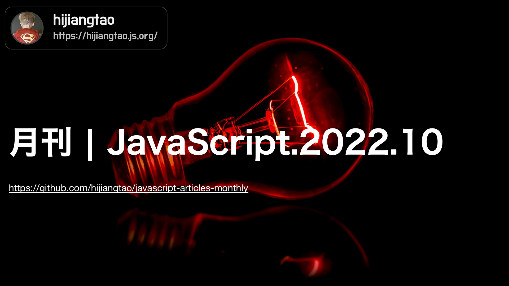

# 月刊 | JavaScript.2022.10 - 很酷的开源库

[返回首页](https://github.com/hijiangtao/javascript-articles-monthly)

本期介绍两个开源库，一个支持 OCR 识别，一个可视化 JSON 数据，详见清单最后两条。

## 清单

本期话题包含框架演进讨论、TypeScript、ECMAScript 提案、开发最佳实践、JavaScript API、Node.js、React Native、JavaScript 历史、时间操作开源库、JavaScript 开发案例、开源库介绍等。

* [JavaScript 框架的新浪潮](https://frontendmastery.com/posts/the-new-wave-of-javascript-web-frameworks/) - frontendmastery.com
* [来释放图灵完备类型系统 TypeScript 的潜力：基础篇](https://type-level-typescript.com/) - TypeScript
* [ECMAScript 提案介绍 - Extractors](https://github.com/tc39/proposal-extractors) - tc39
* [现代 NPM 包开发最佳实践](https://snyk.io/blog/best-practices-create-modern-npm-package/) - snyk.io
* [你不知道的 JavaScript API](https://www.smashingmagazine.com/2022/09/javascript-api-guide/) - Juan Diego Rodríguez
* [书籍：使用 Node.js 编写 Shell 脚本](https://exploringjs.com/nodejs-shell-scripting/) - 2ality
* [Node.js 综述：架构、API、事件循环与并发](https://exploringjs.com/nodejs-shell-scripting/ch_nodejs-overview.html) - 2ality
* [迎接 React Native 0.70](https://reactnative.dev/blog/2022/09/05/version-070) - reactnative.dev
* [JavaScript 历史时间线一览](https://blog.risingstack.com/history-of-javascript-on-a-timeline/) - RisingStack Engineering
* [Temporal API - 一种操作 Date 与 Time 的 JavaScript "API"](https://refine.dev/blog/temporal-date-api/) - Muhammed
* [用 JavaScript 构建一个飞机雷达系统](https://charliegerard.dev/blog/aircraft-radar-system-rtl-sdr-web-usb/) - charliegerard.dev
* [Tesseract.js 3.0 - 一款支持100+语言的 OCR JavaScript 开源库](https://tesseract.projectnaptha.com/)
* [JSON Crack - 一款即时将你的 JSON 数据可视化为图表的开源库](https://jsoncrack.com/)

## 动态

* [TypeScript 4.9 Beta 发布](https://devblogs.microsoft.com/typescript/announcing-typescript-4-9-beta/)
* [Node v18.10.0 发布](https://nodejs.org/en/blog/release/v18.10.0/)
* [Electron 21.0.0 发布](https://www.electronjs.org/blog/electron-21-0)
* [preact 10.11.0 发布](https://github.com/preactjs/preact/releases)

