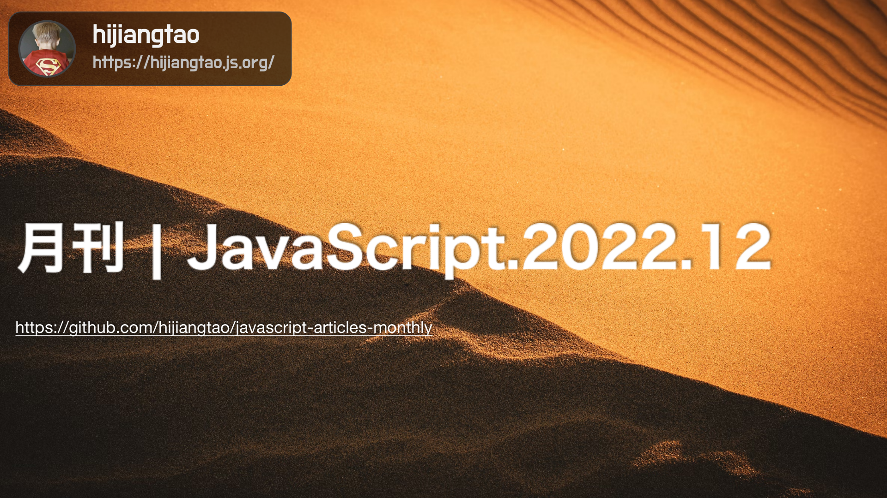

# 月刊 | JavaScript.2022.12

[返回首页](https://github.com/hijiangtao/javascript-articles-monthly)

## 清单

本期话题包含 Realm、Generator、TypeScript、Angular、React Native、Vue、Turbopack、Deno、Temporal API、Nodejs 安全等。

* [JavaScript 中的 Realm 究竟是什么？](https://weizman.github.io/page-what-is-a-realm-in-js/) - weizman
* [为什么我们需要 JavaScript Generator 函数？](https://jrsinclair.com/articles/2022/why-would-anyone-need-javascript-generator-functions/) - jrsinclair.com
* [TypeScript 4.9 正式发布](https://devblogs.microsoft.com/typescript/announcing-typescript-4-9/) - microsoft
* [Angular 15 正式发布](https://blog.angular.io/angular-v15-is-now-available-df7be7f2f4c8) - angular.io
* [面向2022以及未来的 React Native](https://semaphoreci.com/blog/react-native) - semaphoreci
* [优化一个 Vue 应用](https://www.smashingmagazine.com/2022/11/optimizing-vue-app/) - smashingmagazine.com
* [Turbopack 真的比 Vite 快10倍吗？](https://github.com/yyx990803/vite-vs-next-turbo-hmr/discussions/8) - yyx
* [使用诸如 React, Vue, Express 的框架构建 Deno 应用](https://deno.com/blog/frameworks-with-npm) - deno.com
* [Temporal 介绍：更好的 JavaScript Date API](https://vladmihet.hashnode.dev/temporal-api-javascript-dates-but-better) - vladmihet.hashnode.dev
* [Node.js 安全最佳实践](https://nodejs.org/en/docs/guides/security/) - nodejs.org

## 动态

* [pnpm 7.15.0 发布](https://github.com/pnpm/pnpm/releases/tag/v7.15.0)
* [Parcel 2.8.0 发布](https://parceljs.org/blog/v2-8-0/)
* [Node 19.1.0 发布](https://nodejs.org/en/blog/release/v19.1.0/)
* [TypeScript 4.9 发布](https://devblogs.microsoft.com/typescript/announcing-typescript-4-9/)
* [Prettier 2.8.0 发布](https://prettier.io/blog/2022/11/23/2.8.0.html)
* [VS Code 2022年10月更新](https://code.visualstudio.com/updates/v1_73)

