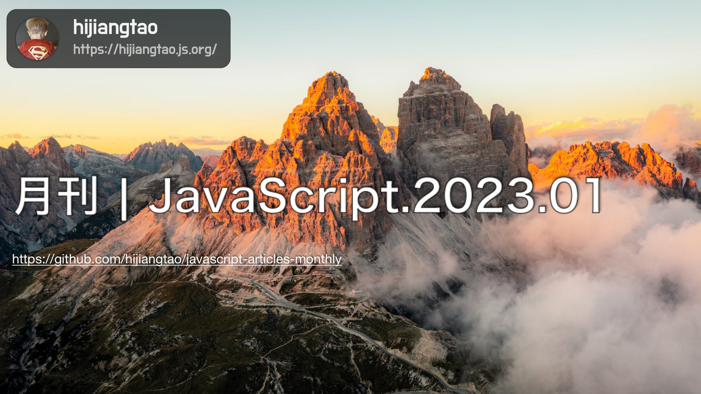

# 2023.01 / JavaScript 月刊

[返回首页](https://github.com/hijiangtao/javascript-articles-monthly)

## 清单

本期话题包含测试最佳实践、npm 包开发、Node.js 框架、Svelte、Web 开发历史、Web Worker、React、TypeScript、函数组件、Redux、跨端框架、编码技能经验等。

* [JavaScript 与 Node 测试最佳指南（2022版本）](https://github.com/goldbergyoni/javascript-testing-best-practices#readme) - goldbergyoni
* [现代 npm 包开发最佳实践](https://snyk.io/blog/best-practices-create-modern-npm-package/) - Brian Clark
* [2022最流行的 Node.js 框架](https://stackdiary.com/node-js-frameworks/) - stackdiary.com
* [从 Vue 2 到 Svelte 迁移经验](https://escape.tech/blog/from-vue2-to-svelte/) - escape.tech
* [2022 Web 开发革命](https://plainenglish.io/blog/the-evolution-of-web-development-2022) - plainenglish.io
* [Web worker, React 与 TypeScript](https://blog.logrocket.com/web-workers-react-typescript/) - LogRocket
* [如何使用 TypeScript 开发 React 函数组件](https://blog.mitsunee.com/post/typing-react-components) - blog.mitsunee.com
* [React Hooks vs. Redux](https://dev.to/qbentil/react-hooks-vs-redux-51p7) - dev.to
* [Flutter Vs React Native 2023版选型指南](https://medium.com/@fullstackdevteams/a-guide-to-flutter-vs-react-native-for-2023-486fcb71a94a) - medium.com
* [五个提升个人编码技能的方法](https://mspoweruser.com/5-ways-to-improve-your-coding-and-programming-skills/) - mspoweruser.com

## 动态

* [Node v19.3.0 发布](https://nodejs.org/en/blog/release/v19.3.0/)
* [jQuery v3.6.2 发布](https://blog.jquery.com/2022/12/13/jquery-3-6-2-released/)
* [Vite 4 发布](https://vitejs.dev/blog/announcing-vite4.html)
