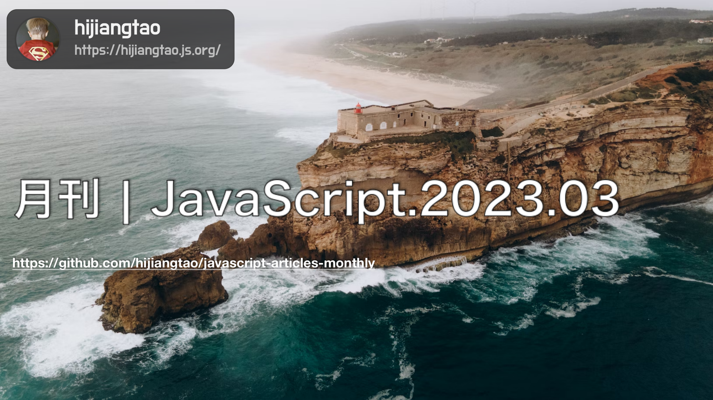

# 2023.03 / JavaScript 月刊 - Node.js 之父专访

本期主题见清单第一条，为 Node.js 之父谈如何重建 Web 运行时的专访。

[返回首页](https://github.com/hijiangtao/javascript-articles-monthly)

## 清单

本期话题包含 ECMAScript、Vue、Chrome 插件分析、React、Lodash、JavaScript 事件监听器、Web 开发趋势、SSR、eslint、代码开发、Web 运行时等。

* [访谈：Node.js 之父 Ryan Dahl 想重建 Web 运行时](https://www.sequoiacap.com/article/deno-spotlight/) - ryan
* [ECMAScript® 2023 语言标准出炉](https://tc39.es/ecma262/) - tc39
* [2023年对 Vue 的期待](https://thenewstack.io/vue-2023/) - Evan You
* [如何开发一个可以窃取一切数据的 Chrome 插件](https://mattfrisbie.substack.com/p/spy-chrome-extension) - mattfrisbie
* [Create React App 的现状与未来](https://github.com/reactjs/reactjs.org/pull/5487#issuecomment-1409720741) - dan
* [你可能并不需要 Lodash/Underscore](https://github.com/you-dont-need/You-Dont-Need-Lodash-Underscore#readme) - stevemao
* [谈谈移除 JavaScript 事件监听器的几种方法](https://www.macarthur.me/posts/options-for-removing-event-listeners) - macarthur.me
* [2023年 Web 开发的10大趋势](https://www.robinwieruch.de/web-development-trends/) - robinwieruch.de
* [Web 的未来（以及过去）是 SSR](https://deno.com/blog/the-future-and-past-is-server-side-rendering) - deno.com
* [用 eslint 加速 JavaScript 生态](https://marvinh.dev/blog/speeding-up-javascript-ecosystem-part-3/) - marvinh.dev
* [在不使用构建系统的情况下编写 JavaScript 代码](https://jvns.ca/blog/2023/02/16/writing-javascript-without-a-build-system/) - jvns.dev
* [深入理解 Angular 中的 OnPush 变更检测策略](https://indepth.dev/posts/1515/deep-dive-into-the-onpush-change-detection-strategy-in-angular) - indepth.dev

## 动态

* [Node v19.7.0](https://nodejs.org/en/blog/release/v19.7.0/)
* [Next.js 13.2](https://nextjs.org/blog/next-13-2)
* [preact 10.13.0](https://github.com/preactjs/preact/releases/tag/10.13.0)
* [Angular v15.2.0](https://github.com/angular/angular/releases/tag/15.2.0)
* [electron v22.2.0](https://github.com/electron/electron/releases/tag/v22.2.0)
* [pnpm v7.27.0](https://github.com/pnpm/pnpm/releases/tag/v7.27.0)
* [cypress v12.7.0](https://github.com/cypress-io/cypress/releases)
