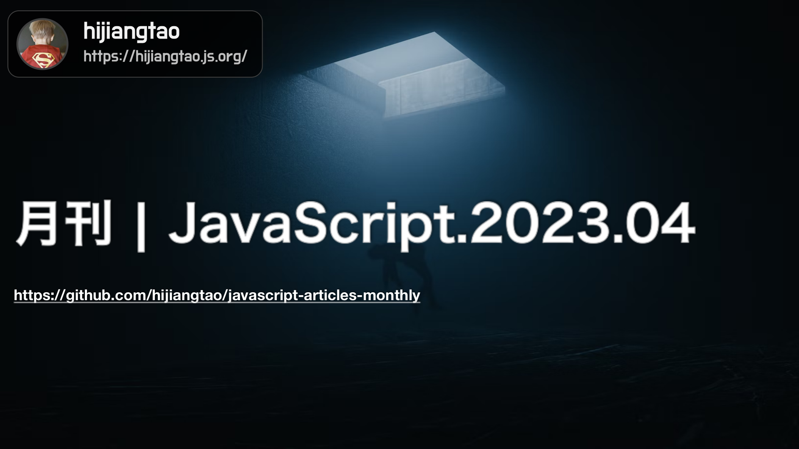

# 2023.04 / JavaScript 月刊 - 前端开发走向终结

[返回首页](https://github.com/hijiangtao/javascript-articles-monthly)

面向 GPT-4，前端开发是否已经走到终点，本期清单提供有一位博主写的文章，谈到了关于这方面其个人的思考，欢迎阅读清单第一篇文章。

## 清单

本期话题包含前端开发未来展望、React 框架未来展望、Web API、TC39 会议纪要、Visual Studio Code、React 开源进展、JavaScript 开发实践、语言特性介绍、TypeScript 仓库变动进展、npm scripts、deno、React 实践、JavaScript 站点生成工具回顾、JavaScript 垃圾回收器、astro.js、electron 等。

* [前端开发走向终结](https://www.joshwcomeau.com/blog/the-end-of-frontend-development/) - joshwcomeau.com
* [JavaScript import maps 特性如今已跨浏览器支持](https://web.dev/import-maps-in-all-modern-browsers/) - web.dev
* [来自第95次 TC39 会议的信息更新](https://dev.to/hemanth/updates-from-the-95th-tc39-meeting-ne5) - dev.to
* [Visual Studio Code 2023年3月更新进展](https://code.visualstudio.com/updates/v1_77) - visualstudio.com
* [React Lab：我们正在进行的工作- 2023年3月](https://react.dev/blog/2023/03/22/react-labs-what-we-have-been-working-on-march-2023) -
* [用 JavaScript 生成与下载文本文件](https://www.amitmerchant.com/create-and-download-text-files-using-javascript/) - amitmerchant.com
* [过去三年 JavaScript 与 TypeScript 语言新特性汇总](https://betterprogramming.pub/all-javascript-and-typescript-features-of-the-last-3-years-629c57e73e42) - betterprogramming.pub
* [使用 ECMAScript Modules 迁移 TypeScript 代码仓库](https://devblogs.microsoft.com/typescript/typescripts-migration-to-modules/) - microsoft
* [JavaScript 生态运行加速——npm scripts](https://marvinh.dev/blog/speeding-up-javascript-ecosystem-part-4/) - marvinh.dev
* [为什么我们在 Deno 中增加对 package.json 的支持](https://deno.com/blog/package-json-support) - deno.com
* [在2023年要如何新建一个 React 项目](https://www.robinwieruch.de/react-starter/) -  robinwieruch.de
* [React 开发人员常见的新手错误](https://www.joshwcomeau.com/react/common-beginner-mistakes/) - joshwcomeau.com
* [JavaScript 站点生成工具年度回顾（2023版）](https://www.zachleat.com/web/site-generator-review/) - zachleat.com
* [用 JavaScript 垃圾回收器做的一些实验](https://dev.to/codux/experiments-with-the-javascript-garbage-collector-2ae3) - dev.to
* [Astro JS 框架：一个构建运行更优网站的实践指南](https://bejamas.io/blog/practical-guide-to-astro-js-framework/) - bejamas.io
* [欢庆 Electron 开源十周年](https://www.electronjs.org/blog/10-years-of-electron) - electronjs.org
* [React 未来展望](https://changelog.com/jsparty/267) - changelog.com

## 动态

* [pnpm v8.1.0](https://github.com/pnpm/pnpm/releases/tag/v8.1.0)
* [Node.js v16.20.0](https://nodejs.org/en/blog/release/v16.20.0)
* [Mongoose 7.0](https://thecodebarbarian.com/introducing-mongoose-7.html)
* [eslint v8.36.0](https://github.com/eslint/eslint/releases/tag/v8.36.0)
* [Ember 4.11](https://blog.emberjs.com/ember-released-4-11/)
* [puppeteer-core: v19.8.0](https://github.com/puppeteer/puppeteer/releases/tag/puppeteer-core-v19.8.0)
* [Deno 1.31](https://deno.com/blog/v1.31)
* [开源库介绍 - Transformers.js](https://xenova.github.io/transformers.js/)
* [TypeScript 5.0](https://devblogs.microsoft.com/typescript/announcing-typescript-5-0/)
