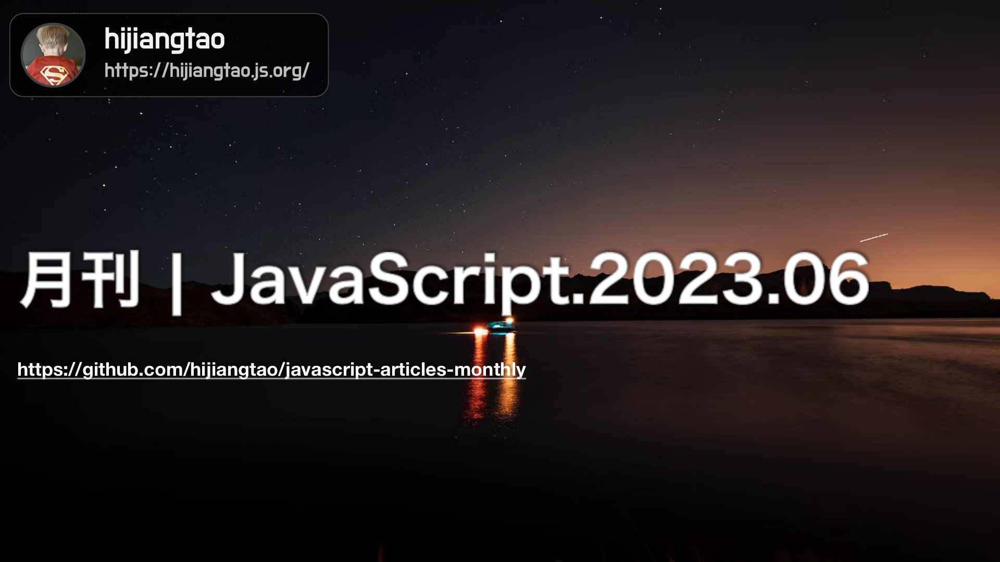

# 2023.06 / JavaScript 月刊

[返回首页](https://github.com/hijiangtao/javascript-articles-monthly)

## 清单

本期话题包含 Node.js 性能、jQuery、性能工具、Bun、ChatGPT、Web Component、Next.js、ECMAScript、JavaScript 生态、类型实现、Angular、Event Loop 等。

* [2023 Node.js 性能现状报告](https://blog.rafaelgss.dev/state-of-nodejs-performance-2023) - 介绍了 Node.js 的性能测试结果和比较分析，以及测试方法和环境。
* [jQuery 3.7.0 特性速览](https://blog.jquery.com/2023/05/11/jquery-3-7-0-released-staying-in-order/) - 介绍了 jQuery 3.7.0 版本的更新内容和改进，主要是修复了一些 bug。
* [Deopt Explorer 介绍](https://devblogs.microsoft.com/typescript/introducing-deopt-explorer/) - 介绍了 TypeScript 的新工具 Deopt Explorer，可以帮助开发者分析 TypeScript 代码的性能问题。
* [Bun Bundler](https://bun.sh/blog/bun-bundler) - 介绍了 JavaScript 打包工具 Bun Bundler，可以提高打包速度和性能。
* [构建你的第一个 JavaScript ChatGPT 插件](https://www.sitepoint.com/javascript-chatgpt-plugin/) - 介绍了一个基于 GPT 技术的 JavaScript 聊天插件，可以实现自然语言聊天功能。
* [JavaScript 非破坏性数组处理方法介绍](https://2ality.com/2022/05/processing-arrays-non-destructively.html) - 介绍了如何在 JavaScript 中非破坏性地处理数组，以及使用 ES6 中的新特性来实现这一目标。
* [WebComponent 入门教程及示例](https://blog.rasvi.io/2023-05-21-webcomponent-intro-with-example) - 介绍了 WebComponent 的基本概念和使用方法，并提供了一个示例来演示如何创建和使用 WebComponent。
* [Next.js 13.4 发布，带来更好的性能和开发体验](https://nextjs.org/blog/next-13-4) - 介绍了 Next.js 13.4 版本的更新内容和改进，包括更好的性能和开发体验。
* [ECMAScript 2023 即将推出的新特性](https://thenewstack.io/the-new-javascript-features-coming-in-ecmascript-2023/) - 介绍了 ECMAScript 2023 即将推出的新特性，包括一些新的语言特性和 API。
* [JavaScript 生态系统的奇妙之处](https://fly.io/blog/js-ecosystem-delightfully-wierd/) - 介绍了 JavaScript 生态系统的一些奇妙之处，包括一些有趣的库和工具。
* [使用 JavaScript 实现完整的类型支持](https://www.pausly.app/blog/full-type-support-with-plain-javascript) - 介绍了如何使用纯 JavaScript 实现完整的类型支持，以及如何使用 Pausly 库来实现这一目标。
* [Angular v16 正式发布](https://blog.angular.io/angular-v16-is-here-4d7a28ec680d) - 介绍了 Angular v16 版本的更新内容和改进，包括更好的性能和开发体验，以及一些新的特性和功能。
* [深入理解 JavaScript 的 Event Loop](https://www.bbss.dev/posts/eventloop/) - 介绍了 JavaScript 中的事件循环机制，包括宏任务和微任务的执行顺序，以及如何避免一些常见的问题和陷阱。该文章提供了一些实例和代码来帮助读者更好地理解事件循环机制。

## 动态

* [TypeScript 5.1 RC](https://devblogs.microsoft.com/typescript/announcing-typescript-5-1-rc/)
* [electron v24.4.0](https://github.com/electron/electron/releases/tag/v24.4.0)
* [preact 10.15.1](https://github.com/preactjs/preact/releases)
* [Node v20.2.0](https://nodejs.org/en/blog/release/v20.2.0)
* [Gatsby v5.10](https://www.gatsbyjs.com/docs/reference/release-notes/v5.10/)
* [Next.js 13.4](https://nextjs.org/blog/next-13-4)
* [pnpm v7.33.0](https://github.com/pnpm/pnpm/releases)

*本文在编写过程采用了 GPT4 技术进行辅助。*
