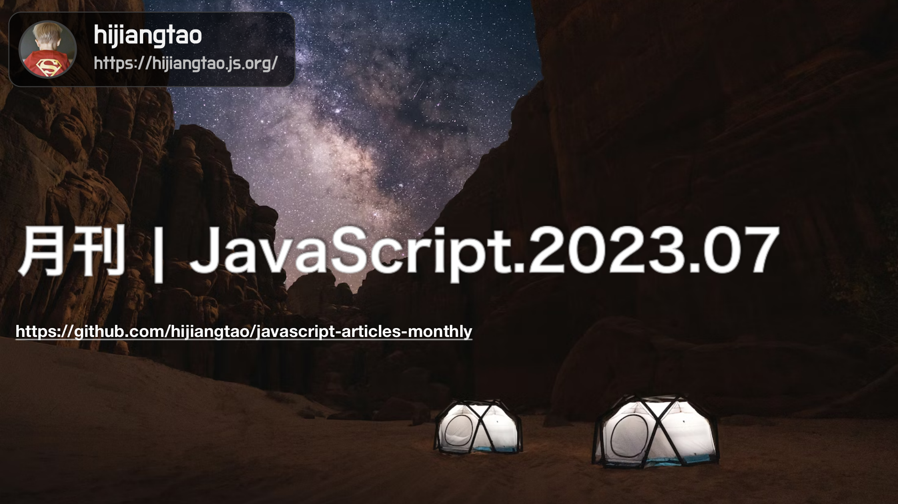

# 2023.07 / JavaScript 月刊

[返回首页](https://github.com/hijiangtao/javascript-articles-monthly)

## 清单

本期话题包含 NPM 生态、devtools 实践、前端性能、TypeScript、浏览器测试、JSX 实现、开发者调查、服务器端组件、文本处理、AI、ECMAScript 提案等。

* [NPM 生态系统中的巨大漏洞](https://blog.vlt.sh/blog/the-massive-hole-in-the-npm-ecosystem) - 这篇文章主要讲述了 NPM 生态系统中的一个巨大漏洞，即由于 NPM 包的依赖关系不可控，可能会导致对项目的恶意攻击。作者提出了一些建议，以帮助开发者保护自己的项目免受这种类型的攻击。
* [常用的 devtools 提示](https://www.smashingmagazine.com/2023/06/popular-devtools-tips/) - 这篇文章介绍了一些常用且主流的 devtools 提示，以帮助开发者更高效地进行前端开发。其中包括使用调试器进行远程调试、使用浏览器插件进行样式调试、使用命令行工具进行快速开发、使用代码编辑器进行自动化操作等。这些提示可以帮助开发者更快速、更准确地进行开发工作。
* [提高前端性能的技巧](https://www.youtube.com/watch?v=ZKH3DLT4BKw&ab_channel=AddyOsmani) - 视频由 Google 工程师 Addy Osmani 主讲。在视频中，他分享了一些提高前端性能的技巧和最佳实践，包括代码分割、懒加载、预取和预加载、图像优化、资源优化等等。他还讨论了如何使用 Chrome 开发者工具来检测和分析性能问题，并提供了一些有用的工具和资源。
* [TypeScript 5.2 新特性：using 关键字](https://www.totaltypescript.com/typescript-5-2-new-keyword-using) - 这篇文章介绍了 TypeScript 5.2 中的新特性：using 关键字。作者通过一些示例代码演示了如何使用 using 关键字来简化代码、减少冗余类型声明和提高代码的可读性。using 关键字可以让开发者在不使用 import 语句的情况下，直接使用模块中的类型和变量，类似于 C# 中的 using 语句。文章还介绍了一些 using 关键字的使用场景和注意事项，以及如何在项目中使用该特性。最后，作者总结了 TypeScript 5.2 中的其他一些新特性，包括类型别名的支持、“unknown”类型的更严格检查等。
* [Chrome 浏览器的测试功能](https://developer.chrome.com/blog/chrome-for-testing/) - 这篇文章介绍了 Chrome 浏览器中的一些测试功能，包括 Lighthouse、DevTools 和 Web Vitals 等。作者详细介绍了这些工具的使用方法和功能，以及如何使用它们来测试和优化网站的性能、可访问性和用户体验。 文章首先介绍了 Lighthouse 工具，它可以测试网站的性能、可访问性、最佳实践和 SEO 等方面，并提供了详细的测试报告和建议。接着，作者介绍了 Chrome DevTools 工具，它可以帮助开发者调试和分析网站的代码，并提供了一些有用的工具和功能，如代码覆盖率、性能分析器和网络面板等。最后，作者介绍了 Web Vitals 工具，它可以检测和报告网站的核心性能指标，如加载时间、交互性能和稳定性。 文章还提到了一些其他的测试工具和技术，如 Chrome 开发者插件、Puppeteer 和 Headless Chrome 等。这些工具和技术可以帮助开发者更轻松地进行测试和优化工作，提高网站的性能和用户体验。
* [裸写 JSX](https://nakedjsx.org/) - 这篇文章介绍了一种裸写 JSX 的方法，即不依赖 React 或其他框架，直接使用原生的 JavaScript 和 JSX 语法来构建 UI。作者通过一些示例代码演示了如何使用裸写 JSX 的方法来创建简单的 UI 元素，如按钮、文本框和下拉列表等。 文章首先介绍了 JSX 的基本语法和工作原理，以及如何在浏览器中使用 Babel 和 JSXTransformer 来编译 JSX 代码。接着，作者介绍了如何使用原生 JavaScript 和 DOM API 来处理事件、更新 UI 和绑定数据。最后，作者总结了裸写 JSX 的优缺点，并提供了一些使用建议和注意事项。这种裸写 JSX 的方法可以让开发者更加灵活地构建 UI，减少对框架的依赖，同时也可以帮助开发者更好地理解 JSX 的工作原理和实现细节。
* [Stack Overflow 2023 开发者调查](https://survey.stackoverflow.co/2023/) - 这篇文章介绍了 Stack Overflow 在 2023 年进行的开发者调查，该调查涵盖了全球范围内的开发者群体、技术趋势和职业发展等方面。文章总结了调查结果中的一些关键数据和趋势，如最受欢迎的编程语言、最流行的开发工具、开发者的教育程度和工作满意度等等。
* [React 服务器端组件讨论](https://github.com/reactwg/server-components/discussions/5) - 这篇文章是一个 GitHub 讨论页面，讨论的主题是 React 服务器端组件（Server Components）。React 服务器端组件是一种新的技术，可以让开发者在服务器端使用 React 组件来生成 HTML，从而加速页面加载速度、提高 SEO 和减轻客户端负担。 讨论页面主要介绍了 React 服务器端组件的基本概念和工作原理，以及如何在项目中使用该技术。讨论还包括了一些技术细节和最佳实践，如如何处理组件的状态和事件、如何处理客户端和服务器端之间的数据同步等。 该讨论页面还有很多评论和回复，包括一些开发者的问题、建议和实践经验。这些评论和回复可以帮助开发者更好地理解 React 服务器端组件的使用和优化，为自己的项目提供参考和指导。
* [JavaScript 文本处理](https://pragprog.com/titles/fkjavascript/text-processing-with-javascript/) - 这篇文章介绍了一本名为《JavaScript 文本处理》的书籍，该书主要讲解如何使用 JavaScript 处理文本数据。书籍的作者是 Flavio Copes，他是一位经验丰富的开发者和技术作家，曾撰写过多本畅销的技术书籍。 《JavaScript 文本处理》一书涵盖了许多文本处理的基础知识和高级技术，如字符串操作、正则表达式、模板字符串、文本解析和生成、字符编码和解码等等。书籍通过一些实用的示例和案例来演示如何使用 JavaScript 处理文本数据，并提供了大量的代码和工具资源，方便读者进行实践和应用。
* [JavaScript 的 AI 入门指南](https://a16z.com/2023/06/21/the-getting-started-with-ai-stack-for-javascript/) - 这篇文章介绍了一篇名为《JavaScript 的 AI 入门指南》的博客文章，该文章提供了一套完整的 AI 开发工具栈，帮助开发者在 JavaScript 中快速入门 AI 技术。该工具栈包括 TensorFlow.js、Brain.js、Synaptic.js、ConvNetJS 和 BrainstormJS 等库和框架，涵盖了深度学习、神经网络、遗传算法和强化学习等多个 AI 领域。
* [ECMAScript 延迟导入和执行提案](https://github.com/tc39/proposal-defer-import-eval) - 该提案旨在为 JavaScript 引入一种新的语法，可以在需要时动态地加载和评估模块，从而提高应用程序的性能和灵活性。 该提案的主要内容包括两个新的关键字：defer import 和 defer eval。defer import 关键字用于延迟加载和评估模块，在需要时才会进行加载和执行。defer eval 关键字用于延迟评估代码字符串，可以在需要时才进行评估和执行。 该提案通过一些示例代码和语法说明来详细介绍了 defer import 和 defer eval 的使用方法和限制。同时，该提案还包括了一些讨论和反馈，以帮助开发者更好地理解和应用该技术。 该提案目前还未被正式纳入 JavaScript 标准，但已经得到了许多开发者和社区的关注和支持。开发者可以通过 GitHub 存储库来了解该提案的最新动态和进展。

## 动态

* [esbuild v0.18.10](https://github.com/evanw/esbuild/releases)
* [styled-components v6.0.0](https://github.com/styled-components/styled-components/releases/tag/v6.0.0)
* [Ember 5.0](https://blog.emberjs.com/ember-5-0-released/)
* [ESLint v8.43.0](https://eslint.org/blog/2023/06/eslint-v8.43.0-released/)
* [angular v16.1.0](https://github.com/angular/angular/releases/tag/16.1.0)
* [TypeScript 5.1](https://devblogs.microsoft.com/typescript/announcing-typescript-5-1/)
* [tfjs-4.8.0](https://github.com/tensorflow/tfjs/releases/tag/tfjs-v4.8.0)
* [nest v10.0.0](https://github.com/nestjs/nest/releases/tag/v10.0.0)
* [Svelte 4](https://svelte.dev/blog/svelte-4)
* [React Native 0.72](https://reactnative.dev/blog/2023/06/21/0.72-metro-package-exports-symlinks)
* [Electron 25.0.0](https://www.electronjs.org/blog/electron-25-0)
* [Parcel v2.9.0](https://parceljs.org/blog/v2-9-0/)
* [Bootstrap 5.3.0](https://blog.getbootstrap.com/2023/05/30/bootstrap-5-3-0/)

*本文在编写过程采用了 GPT4 技术进行辅助。*
