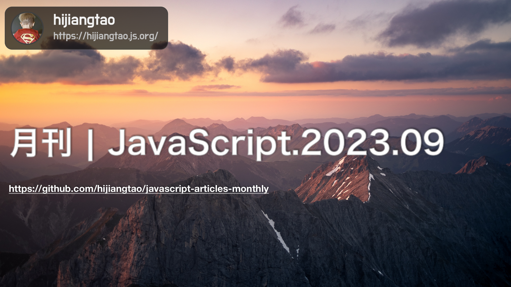

# 月刊 | JavaScript.2023.09

[返回首页](https://github.com/hijiangtao/javascript-articles-monthly)

## 清单

本期话题包含打包方案、Lodash、ESM、WebAssembly、测试、烦调试、Node.js Docker、npx、身份验证、IDE 等。

* [如何将 JavaScript 代码包的大小减少33%](https://dropbox.tech/frontend/how-we-reduced-the-size-of-our-javascript-bundles-by-33-percent) - 这篇文章介绍了Dropbox如何通过更换模块打包工具，减少JavaScript代码包的大小达到33%的效果。文章详细阐述了Dropbox之前的打包工具存在的问题，包括多版本打包、手动代码分割和缺乏树摇等，并阐述了他们为何选择了Rollup作为新的打包工具。文章还详细介绍了Rollup的逐步推出过程以及如何与其他技术一起使用……
* [你可能并不需要 Lodash/Underscore](https://github.com/you-dont-need/You-Dont-Need-Lodash-Underscore#readme) - 该项目列出了可以使用 JavaScript 原生方法实现的功能，而无需使用第三方库 Lodash 或 Underscore。此外，该仓库还提供了一个名为 ESLint Plugin 的工具，用于自动检测代码中是否使用了 Lodash 或 Underscore，并给出警告或错误。该仓库的目的是帮助开发人员更好地理解 JavaScript 原生方法的功能和用法，以及减少对第三方库的依赖……
* [在将包升级为 ESM 后所获得的经验](https://blog.isquaredsoftware.com/2023/08/esm-modernization-lessons/) - 这篇文章是 Redux 维护者 Mark Erikson 的博客，他分享了将 Redux 库升级到 ESM（ECMAScript 模块）的经验和教训。他详细描述了这个过程中遇到的问题，以及他采取的解决方案和配置。文章包括多个部分，如“包的背景与配置”、“早期尝试”、“更新 Immer 包装”等等
* [将 Sharp 移植到 WebAssembly 和 WebContainers](https://blog.stackblitz.com/posts/bringing-sharp-to-wasm-and-webcontainers/) - 这篇文章介绍了如何将高性能图像处理库Sharp移植到WebAssembly和WebContainers中，让它可以在浏览器中运行。作者分享了移植过程中遇到的挑战，包括移植Node-API到WebAssembly、处理图像依赖库libvips的编译和补丁，以及处理SVG和文本支持等问题。作者还讨论了启动同步和Worker API的差异等问题，以及如何解决这些问题。最终，作者成功将Sharp移植到了WebAssembly和WebContainers中，并提供了StackBlitz上的在线演示。
* [一个杰出的 JavaScript 测试文章汇编](https://practica.dev/blog/a-compilation-of-outstanding-testing-articles-with-javaScript/) - 这篇文章是由Practica.js核心维护者Yoni Goldberg编写的，他在这里列出了他认为是杰出的测试文章的精选列表，并提供了一些摘要和评论。这些文章涉及JavaScript和Node.js的测试，以及通用的测试概念和工具。文章包括作者、摘要、阅读时间和链接……
* [绕过 JavaScript 反调试技术](https://www.nullpt.rs/evading-anti-debugging-techniques) - 这篇文章介绍了JavaScript反调试技术，讲述了如何绕过一些网站的调试限制和反反调试机制。作者提到，调试器是开发人员和逆向工程师的重要工具，但许多网站会采取防护措施以阻止对其代码的调试。文章列举了一些绕过反调试机制的方法，包括禁用断点、使用扩展程序和重命名调试关键字等，作者还分享了如何使用自定义浏览器版本来绕过反调试机制。
* [编写高效 NodeJS Docker 镜像的复杂性](https://www.specfy.io/blog/1-efficient-dockerfile-nodejs-in-7-steps) - 这篇文章介绍了如何编写高效的 NodeJS Docker 镜像。作者首先简要介绍了 Docker 的内部原理，然后探讨了如何在 NodeJS 的构建过程中优化镜像大小和构建时间。文章提供了七个步骤，包括使用 .dockerignore 文件、选择 Slim 或 Alpine 镜像、使用多阶段构建等技巧，以及一些其他的优化建议。总的来说，本文提供了一些很好的技巧，可以帮助开发人员更有效地管理他们的 Docker 镜像，从而在构建和部署 NodeJS 应用程序时节省时间……
* [创建一个 npx 工具](https://nayte.dev/posts/creating-an-npx-tool/) - 这篇文章介绍了如何创建一个可以通过 npx 命令在任何地方访问的 NPX 工具。作者首先介绍了如何设置项目，包括在 package.json 文件中添加 "bin" 字段来指定工具的入口文件，以及在入口文件中添加 Shebang 来告诉 shell 使用 Node 来执行该文件。然后，作者介绍了如何将工具发布到 NPM 上，以便在任何机器上使用 npx 命令访问该工具。总的来说，这篇文章提供了一个简单的指南，可以帮助开发人员更轻松地创建和共享他们的 NPX 工具。
* [React 身份验证](https://userfront.com/tutorials/react-authentication) - 这篇文章介绍了在React应用程序中实现身份验证的不同方法，使用了一种名为Userfront的服务来简化身份验证的流程。文章讨论了JWT（JSON Web Tokens）的使用以及如何使用Userfront在React应用程序中设置身份验证，并提供了一些示例代码和演示。此外，文章还介绍了如何在React应用程序中保护路由、使用API进行身份验证以及如何添加单点登录（SSO）等其他功能。
* [13个适合程序员了解的最佳 IDE](https://geekflare.com/ide-for-programmer/) - 本文介绍了“13个每个程序员都应该了解的最佳IDE”，并详细描述了每个IDE的特点。文章解释了什么是集成开发环境（IDE），以及为什么它对软件开发很重要。这些IDE支持C ++、C、PHP、Java、JavaScript、Python等编程语言。

## 动态

* [angular v16.2.0](https://github.com/angular/angular/releases/tag/16.2.0)
* [Fresh 1.4](https://deno.com/blog/fresh-1.4)
* [Electron 26.0.0](https://www.electronjs.org/blog/electron-26-0)
* [Astro 2.10](https://astro.build/blog/astro-2100/)
* [esbuild 0.19.0](https://github.com/evanw/esbuild/blob/main/CHANGELOG.md#0190)

*本文在编写过程采用了 GPT4 技术进行辅助。*
