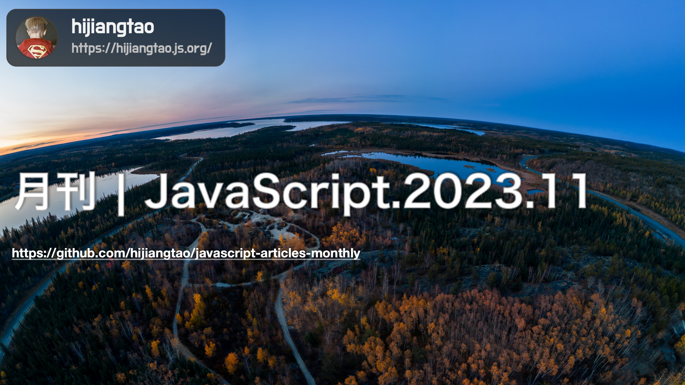

# 月刊 | JavaScript.2023.11

[返回首页](https://github.com/hijiangtao/javascript-articles-monthly)

## 清单

本期话题包含 Web 组件、Solid.js、base64、Barrel File、billboard.js、测试断言、JavaScript 历史、Yalc、JavaScript JIT 编译器、NPM workspaces 等。

* [Web 组件将超越你的 JavaScript 框架](https://jakelazaroff.com/words/web-components-will-outlive-your-javascript-framework/) - 这篇文章讨论了Web组件的重要性和优势，提出了它们在开发中的持久性。作者解释了如何使用Web组件来构建可重用的HTML元素，并强调它们的独立性和可移植性。作者还探讨了Web组件与其他JavaScript框架（如React、Svelte等）的比较，并提供了示例代码和用法。
* [Solid.js 的作者介绍了减少 JavaScript 代码的方法](https://thenewstack.io/solid-js-creator-outlines-options-to-reduce-javascript-code/) - 这篇文章介绍了Solid.js框架的创建者讨论了减少JavaScript代码的不同选项。作者探讨了在开发过程中优化代码的方法，包括使用编译器优化、减少依赖、避免重复代码等。文章还涵盖了Solid.js框架的特点和优势，并提供了实际示例和建议。
* [JavaScript 中 base64 编码字符串的细微差别](https://web.dev/articles/base64-encoding) - base64 编码和解码是将二进制内容表示为可在 web 环境中安全的文本的常见形式。它通常用于数据网址，例如内嵌图片。对 JavaScript 中的字符串应用 base64 编码和解码时，会发生什么情况？此博文探讨了需要避免的细微差别和常见误区。
* [加速 JavaScript 生态系统：桶文件的困境](https://marvinh.dev/blog/speeding-up-javascript-ecosystem-part-7/) - 这篇文章探讨了JavaScript生态系统中的性能优化问题，特别是与"桶文件"（Barrel File）相关的挑战。作者讨论了桶文件的含义以及它们对应用程序性能的影响。文章中提供了优化桶文件的建议和技术，并介绍了如何提高JavaScript生态系统的整体性能。
* [billboard.js 3.10 版本发布：点状径向渐变、新主题和改进的稳定性](https://netil.medium.com/billboard-js-3-10-release-point-radialgradient-new-theme-and-improved-stability-0f6b8054ef33) - 这篇文章发布了billboard.js 3.10版本的更新内容，包括了点状径向渐变、新主题和改进的稳定性。文章提到了6个新功能、21个错误修复和改进。其中，点状径向渐变可以应用于圆形点，提供了一种不同的可视化方式。新的主题"modern"也在此版本中添加，可以作为项目的起始样式或直接使用。另外，还介绍了新添加的subchart API用于控制子图的选择范围，以及regions.label选项用于给区域添加标签文本。同时，还提到了tooltip的y坐标位置选项的改进和TableView插件的nullString选项的增强。此外，文章还提及了对填充(padding)选项的改进和测试覆盖率的提高。最后，作者表示会继续努力推出更多增强功能。
* [JavaScript 中的测试断言风格](https://blog.izs.me/2023/09/software-testing-assertion-styles/) - 该文章介绍了JavaScript中的测试断言风格。作者讨论了在测试框架中集成断言库的原因以及JavaScript测试API中常见的两种风格："规范家族"和"tap家族"。作者解释了这两种风格的优势和不同之处，并讨论了它们在JavaScript测试工具中的应用。文章还提到了JavaScript开源工具选项的丰富性和多样性，并讨论了测试框架在保持灵活性和一致性方面的权衡。
* [Brendan Eich 真的在10天内创造了 JavaScript 吗？](https://buttondown.email/hillelwayne/archive/did-brendan-eich-really-make-javascript-in-10-days/) - 该文章探讨了JavaScript的创造者Brendan Eich是否真的在10天内开发了JavaScript这门语言。作者回顾了JavaScript的历史，并介绍了它的起源和发展过程。文章解释了JavaScript的设计目标以及在Web浏览器中的重要性。作者还回顾了Brendan Eich的经历和他在开发JavaScript时的背景情况，并讨论了关于JavaScript开发时间的一些误解。
* [使用 Yalc 测试你的 React 库](https://www.propelauth.com/post/test-your-react-libraries-with-yalc) - 这篇文章介绍了如何使用Yalc在本地测试React库。作者解释了Yalc是什么以及它的作用。文章指导读者如何使用Yalc将React库链接到本地项目，并进行本地开发和测试。作者还提供了一些示例和建议，帮助读者更好地理解和使用Yalc进行React库的本地测试。
* [让我们原型化一个 JavaScript JIT 编译器](https://www.youtube.com/watch?v=8mxubNQC5O8&ab_channel=AndreasKling) - YouTube
* [在你的 TypeScript Monorepo 项目中使用 NPM 工作区](https://www.yieldcode.blog/post/npm-workspaces/) - 这篇文章介绍了使用NPM工作区（NPM workspaces）和TypeScript的TypeScript Monorepo的概念。作者详细解释了如何设置工作区，以及如何在一个Monorepo中管理多个独立的包（packages）。文章包括了设置NPM工作区的步骤、TypeScript的配置、创建和管理包、依赖管理等方面的内容。

## 动态

* [yarn 4.0](https://yarnpkg.com/blog/release/4.0)
* [Electron 27.0.0](https://www.electronjs.org/blog/electron-27-0)
* [parcel 2.10.0](https://github.com/parcel-bundler/parcel/releases/tag/v2.10.0)
* [pnpm 8.8.0](https://github.com/pnpm/pnpm/releases/tag/v8.8.0)

*本文在编写过程采用了 GPT4 技术进行辅助。*
