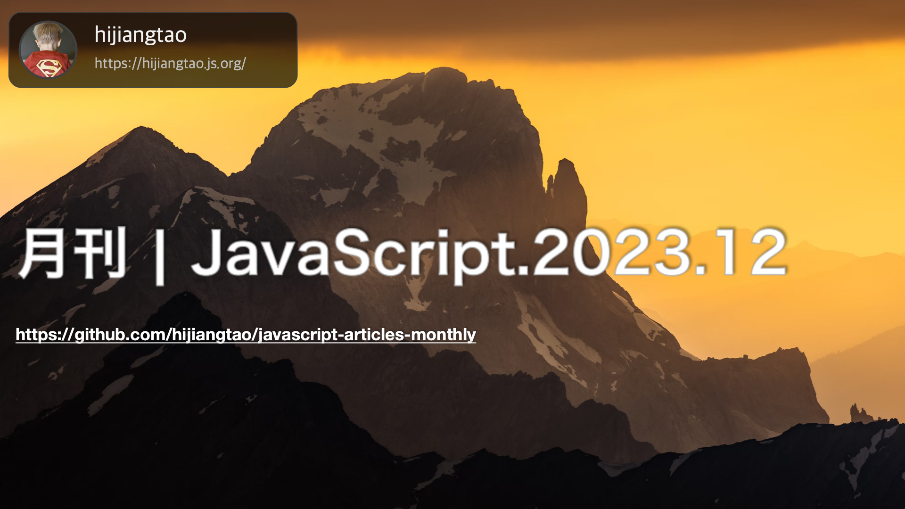

# 月刊 | JavaScript.2023.12

[返回首页](https://github.com/hijiangtao/javascript-articles-monthly)

感谢大家今年对 JavaScript 月刊的持续关注，我们2024再见！

## 清单

本期话题包含 Web Components、Prettier、Vue、Vi特、JavaScript 异常、基准测试、Bun、OpenAI、promise、Tailwind CSS、组件开发、TypeScript、Signals、Angular、DOM 操作、npm 包、React、V8 字符串、JavaScript 框架等。

* [用 Web Components 消除对 JavaScript 框架的锁定](https://jakelazaroff.com/words/web-components-eliminate-javascript-framework-lock-in/) - 这篇文章讨论了 Web Components 的概念和如何使用它们来减少对特定 JavaScript 框架的依赖和锁定。它介绍了 Web Components 的优势、使用方法以及如何在现有项目中引入和使用它们。
* [Biome 的 Prettier 实践之旅](https://biomejs.dev/blog/biome-wins-prettier-challenge/) - 这篇文章宣布了 Biome 在 Prettier 挑战中的胜利。它介绍了 Biome 的特点和功能，并解释了为什么 Biome 是一个优秀的代码格式化工具。
* [Vue & Vite 现状概览](https://www.youtube.com/watch?v=Hz_zCR28oKE) - 这个视频是 Evan You 关于 Vue 和 Vite 现状介绍的演讲。他讨论了 Vue 和 Vite 的最新进展、改进和功能，以及他们在前端开发中的应用。
* [你错过的2023年10个JavaScript变化](https://www.youtube.com/watch?v=ANCm3oG7htM) - 这个视频介绍了2023年你可能错过的10个 JavaScript 变化。它涵盖了各种 JavaScript 技术和工具的更新和改进，以及对开发者的影响。
* [使用 Playwright 跟踪前端 JavaScript 异常](https://www.checklyhq.com/blog/track-frontend-javascript-exceptions-with-playwright/) - 这篇文章讨论了使用 Playwright 来跟踪前端 JavaScript 异常的方法。它解释了 Playwright 的基本概念和用法，并演示了如何设置和使用 Playwright 来监视和记录前端应用程序中的异常。
* [JavaScript 中的简单 WebSocket 基准测试：Node.js vs Bun](https://lemire.me/blog/2023/11/25/a-simple-websocket-benchmark-in-javascript-node-js-versus-bun/) - 这篇文章介绍了使用 JavaScript 进行 WebSocket 基准测试的方法，并比较了 Node.js 和 Bun 之间的性能差异。它解释了如何设置和运行基准测试，并提供了性能比较的结果和分析。
* [迎接 Bun 1.0.14](https://bun.sh/blog/bun-v1.0.14) - 关于 Bun 1.0.14 的版本功能介绍。
* [使用 OpenAI 平台分析失败的自动化测试](https://labs.pineview.io/using-openai-platform-to-analyse-automated-test-failures/) - 该文章介绍了如何利用 OpenAI 平台来分析自动化测试的失败情况。
* [promises-training](https://github.com/henriqueinonhe/promises-training) - 通过精选的互动挑战练习使用 Promises。该存储库提供了一个平台，通过自动化测试为您提供即时反馈，以验证您的进展。
* [你的网站不需要 JavaScript](https://www.youtube.com/watch?v=wKU65gV6FSA) - 该视频的主题是 Amy Kapernick 在 Copenhagen DevFest 2023 上的演讲，讲述了网站在某些情况下不需要使用 JavaScript 的原因和方法。
* [加速 JavaScript 生态系统 - Tailwind CSS](https://marvinh.dev/blog/speeding-up-javascript-ecosystem-part-8/) - 这篇文章介绍了如何加快 JavaScript 生态系统的速度，以 Tailwind CSS 为例。作者通过对 Tailwind CSS 代码进行分析和优化，提供了一些性能改进的方法，并说明了关键的时间消耗区域。
* [编写适用于任何前端框架的组件](https://component-odyssey.com/articles/01-writing-components-that-work-in-any-framework) - 这篇文章讨论了如何编写在任何前端框架中都有效的组件。作者探讨了通用组件的概念和设计原则，并提供了一些实践建议，使组件能够在不同的前端框架中重用。
* [如何从 JavaScript 向 TypeScript 转换](https://v5.chriskrycho.com/journal/how-to-do-a-typescript-conversion/) - 这篇文章由 Chris Krycho 撰写，介绍了如何进行 TypeScript 转换。作者详细解释了从 JavaScript 到 TypeScript 的转换过程，并提供了一些有用的技巧和建议。
* [为什么信号（Signals）比 React Hooks 更好](https://www.youtube.com/watch?v=SO8lBVWF2Y8) - 该视频探讨了为什么信号（Signals）比 React Hooks 更好。视频中讲解了信号的概念、优势以及在开发中的应用场景，并对比了它与 React Hooks 的区别和优劣势。
* [如何使用原生 JavaScript 操纵 DOM](https://phuoc.ng/collection/html-dom/) - 本文介绍了 HTML DOM（文档对象模型）的基本概念和用法。它解释了如何使用 JavaScript 与 HTML 文档进行交互，包括访问、修改和操作 HTML 元素、属性和事件等。
* [通过 Angular 17 重新介绍 Angular](https://blog.angular.io/introducing-angular-v17-4d7033312e4b) - 本文介绍了 Angular 17 的新特性和改进。它涵盖了 Angular 框架的更新内容，包括性能改进、新功能、修复和其他增强，以及如何升级到最新版本。
* [如何在 node 环境之外运行 npm 包](https://neon.tech/blog/using-npm-packages-outside-node) - 本文介绍了如何在 Node 之外的环境中使用 NPM 包。它探讨了一些简单的技术，可以让你在Vercel Edge Functions、Web 浏览器等地方运行NPM包，解决了一些 NPM 包在非 Node.js 环境中出现错误的问题。
* [回到 React 的怀抱](https://daily.dev/blog/moving-back-to-react) - 本文讨论了从其他 JavaScript 框架回归 React 的经验和原因。它探讨了 React 的优势和适用场景，并提供了一些建议和实践，帮助开发人员顺利过渡回 React。
* [深入 V8 字符串：实现与优化](https://iliazeus.github.io/articles/js-string-optimizations-en/) - 本文深入探讨了 V8 引擎中字符串的实现和优化。它解释了字符串的内部表示和处理方式，并介绍了一些优化技术和策略，以提高 JavaScript 代码中字符串的性能。
* [轻量级 JavaScript 框架概览（专为 Django 开发者设计）](https://saashammer.com/blog/lightweight-javascript-framework-review-for-django-developers/) - 本文为 Django 开发人员评估了几个轻量级的 JavaScript 框架。它对每个框架进行了介绍、比较和评价，并提供了选择适合 Django 项目的最佳框架的指导和建议。
* [HTML Web Components](https://blog.jim-nielsen.com/2023/html-web-components/) - 本文介绍了 HTML Web Components 的概念和用法。它解释了如何使用 Web 组件创建可重用的自定义 HTML 元素，并讨论了 Web 组件的优势和实际应用场景。

## 动态

* [pnpm v8.11.0](https://github.com/pnpm/pnpm/releases/tag/v8.11.0)
* [Vite 5.0](https://vitejs.dev/blog/announcing-vite5)
* [transformers.js 2.9.0](https://github.com/xenova/transformers.js/releases/tag/2.9.0)
* [Rspack 0.4](https://www.rspack.dev/zh/blog/announcing-0.4.html)
* [Node v21.2.0](https://nodejs.org/en/blog/release/v21.2.0)
* [TypeScript 5.3](https://devblogs.microsoft.com/typescript/announcing-typescript-5-3/)
* [Deno 1.38](https://deno.com/blog/v1.38)
* [prettier 3.1.0](https://prettier.io/blog/2023/11/13/3.1.0)
* [reveal.js 5.0.0](https://github.com/hakimel/reveal.js/releases/tag/5.0.0)

*本文在编写过程采用了 GPT4 技术进行辅助。*
