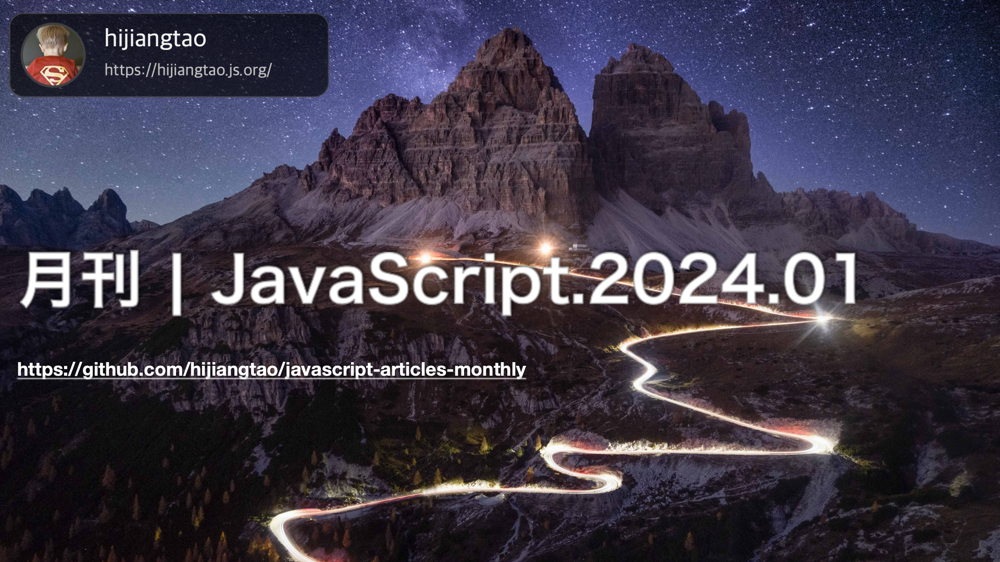

# 月刊 | JavaScript.2024.01

[返回首页](https://github.com/hijiangtao/javascript-articles-monthly)

## 清单

本期话题包含 Web 组件、JavaScript 框架选择、深度克隆对象、V8 引擎改进、TypeScript 起源、Oxlint 发布、Deno、Electron、JIT、现代 JavaScript 框架工作原理以及 Angular 剖析等内容。

* [Web 组件将超越你的 JavaScript 框架](https://jakelazaroff.com/words/web-components-will-outlive-your-javascript-framework/) - 这篇文章讨论了在项目开发中选择JavaScript框架的困扰，作者提出了使用Web组件作为一种可行的选择。作者分享了自己在使用Web组件的项目中的经验，并解释了为什么Web组件是一种可持续的解决方案。文章还介绍了Web组件的基本概念和用法，并提到了它们的优势和灵活性。作者还讨论了使用纯JavaScript和Markdown编写可移植内容的好处，并强调了将所有代码封装在单个文件中的便利性……
* [JavaScript 深度克隆对象的现代化方式](https://www.builder.io/blog/structured-clone) - 这篇文章介绍了在JavaScript中进行深度克隆对象的现代方式。作者首先提到了JavaScript运行时中内置的structuredClone函数，可以实现深度复制对象、嵌套数组甚至包括Date对象等功能。相比于浅拷贝方法（如对象扩展、Object.assign等），structuredClone可以克隆无限嵌套的对象和数组、处理循环引用、克隆多种JavaScript类型（如Date、Set、Map、Error、RegExp等）以及转移可传输对象。文章还比较了structuredClone与JSON.parse(JSON.stringify(x))和Lodash的cloneDeep函数的区别，以及structuredClone不支持克隆函数、DOM节点、属性描述符和原型链等内容……
* [V8比以往更快、更安全](https://v8.dev/blog/holiday-season-2023) - 这篇文章是V8团队的博客文章，介绍了V8 JavaScript和WebAssembly引擎在2023年取得的成就和进展。文章强调V8在速度、性能优化和安全性方面的专注。 V8团队引入了一个名为Maglev的新的中级优化编译器，它以更快的速度生成优化代码，相比现有编译器有显著的性能改进。这导致JetStream和Speedometer等基准测试中的性能显著提升。 他们还引入了Turboshaft，这是一个新的顶级优化编译器Turbofan的内部架构。这个架构使得扩展新的优化更容易，并提高了编译速度。 为了增强整体的Web性能，V8团队优化了HTML解析，改进了DOM对象的内存分配策略，并推出了可调整大小的ArrayBuffers、String isWellFormed和toWellFormed等新的JavaScript特性。 在WebAssembly（Wasm）方面，V8支持了多内存、尾调用和松散的SIMD，并实现了memory64。他们还发布了WebAssembly垃圾回收（WasmGC），允许在Wasm中管理对象和数组，这样可以比将它们编译为JavaScript时运行得更快。 文章还强调了V8在安全方面的承诺，改进了沙盒基础设施，并引入了控制流完整性（CFI），为用户提供更安全的环境……
* [纪录片：TypeScript 起源](https://www.youtube.com/watch?v=U6s2pdxebSo) - 该纪录片介绍了TypeScript的核心贡献者和社区成员，如Anders Hejlsberg、Steve Lucco、Luke Hoban、Daniel Rosenwasser、Ryan Cavanaugh、Amanda Silver、Matt Pocock、Josh Goldberg等等！它还涵盖了来自JetBrains、Xata、AG_Grid、Deno、Visual Studio Code和Bloomberg科技等机构的采用故事和见解。
* [Oxlint 正式发布](https://oxc-project.github.io/blog/2023-12-12-announcing-oxlint.html) - 这篇文章宣布了Oxlint的正式发布。Oxlint是一个JavaScript代码检查工具，可以在不需要任何配置的情况下捕获错误或无用的代码。文章介绍了Oxlint的使用方法、性能优势、正确性检查功能以及其易用性和增强的诊断功能。
* [Deno 1.39: WebGPU 的回归](https://deno.com/blog/v1.39) - 这篇文章介绍了Deno 1.39版本中引入的WebGPU功能以及其对Web开发的影响。
* [通过构建一个现代 JavaScript 框架来学习其工作原理](https://nolanlawson.com/2023/12/02/lets-learn-how-modern-javascript-frameworks-work-by-building-one/) - 这篇文章通过构建一个现代JavaScript框架来探讨和学习现代JavaScript框架的工作原理，并介绍了React以后的一些流行框架的共同特点和设计思路。
* [Maglev - V8的最快优化 JIT](https://v8.dev/blog/maglev) - 该文章介绍了V8 JavaScript引擎中的Maglev优化编译器，它在现有的Sparkplug和TurboFan编译器之间起到快速优化编译器的作用，生成足够优化的机器代码。
* [2023年 Electron 生态系统回顾](https://www.electronjs.org/blog/ecosystem-2023-eoy-recap) - 该文章回顾了Electron开发者生态系统在2023年的改进和变化。主要介绍了Electron Forge 7及其更新，静态存储自动更新的改进，@electron/扩展宇宙的统一，以及@electron/windows-sign的引入。文章还提及了未来的计划和对读者的反馈期望。
* [Angular深度剖析 - Angular 是何时、何地、为何以及如何进行图片优化的](https://angularindepth.com/posts/1522/the-who-what-where-when-why-and-how-of-image-optimization-in-angular) - 该文章深入探讨了在Angular中进行图像优化的问题。它涵盖了何时进行图像优化、在哪里进行图像优化、为什么进行图像优化以及如何进行图像优化的方方面面。文章提供了有关图像格式、压缩、懒加载和响应式图像等方面的详细说明和实践建议。读者将了解如何通过优化图像来提高Angular应用的性能和用户体验。

## 动态

* [Astro 4.0](https://astro.build/blog/astro-4/)
* [Electron 28.0.0](https://www.electronjs.org/blog/electron-28-0)
* [React Native 0.73](https://reactnative.dev/blog/2023/12/06/0.73-debugging-improvements-stable-symlinks)
* [rollup v4.9.5](https://github.com/rollup/rollup/releases/tag/v4.9.5)
