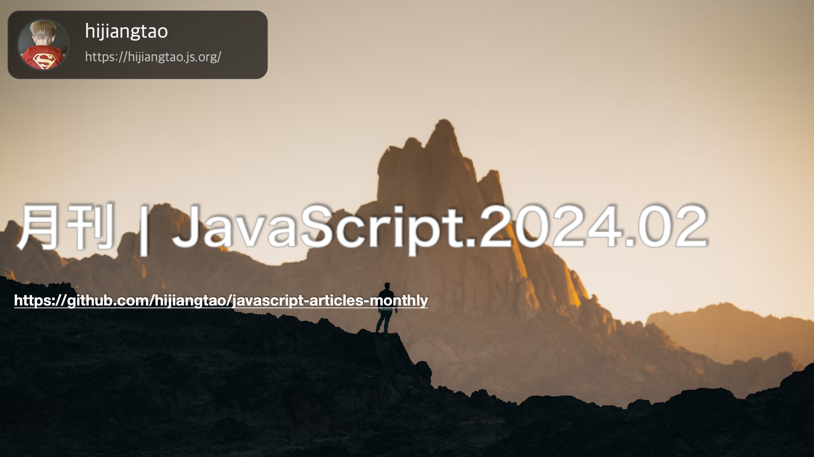

# 月刊 | JavaScript.2024.02

[返回首页](https://github.com/hijiangtao/javascript-articles-monthly)

## 清单

本期话题包含 Node.js、JavaScript 开源库、面试题、数组、react server component、JS 概念、断言、CSS、Web API、React 库、AHA、React 开发、GitHub Copilot、Bun Shell 等内容。

* [Node.js中的基准测试现状](https://www.webpro.nl/articles/the-state-of-benchmarking-in-nodejs) - 这篇文章讨论了在Node.js和Bun等运行时环境中构建应用程序和工具时，宏观和微观基准测试的重要性。文中探讨了当前可用的基准测试选项，并通过代码示例和一个CodeSandbox来展示如何在自己的应用程序中实现基准测试。文章详细阐述了宏观基准测试的重要性、性能测量工具的生态系统、采用PerformanceObserver和timerify函数等API进行性能监控的实例，以及微观基准测试的生态系统、陷阱和工具选择建议。
* [2023 JavaScript冉冉升起的明星](https://risingstars.js.org/2023/en) - 这是第八届JavaScript冉冉升起的明星评选，展示了2023年JS生态系统的趋势。通过分析GitHub上过去12个月新增星标数量的图表，该文展示了UI组件、前端框架、后端/全栈工具等多个领域内的流行项目。文章总结了2023年整个JS社区的主流热点，如shadcn/ui等项目的兴起，Bun的持续势头，以及Expo、Tamagui、Nativewind等移动开发领域的进展等。
* [2024年每位JavaScript开发者都应知道的10个面试问题](https://medium.com/javascript-scene/10-interview-questions-every-javascript-developer-should-know-in-2024-c1044bcb0dfb) - 本指南挑选了10个每位JavaScript开发者在2024年应当了解的核心面试问题，范围涵盖闭包到测试驱动开发(TDD)等多个主题。文章旨在提供知识和信心，帮助开发者应对现代JavaScript的挑战，不仅是为了通过技术面试，更是为了提升自身技术能力。
* [JavaScript数组处理的新方法](https://12daysofweb.dev/2023/new-js-array-methods/) - 文章介绍了在所有现代浏览器中新增加的几个Array方法：toReversed()、toSpliced()、toSorted()和with()。它详细解释了这些方法的作用和使用方式，包括如何使用toReversed()创建一个数组的倒序副本、使用toSpliced()创建一个经过剪辑的数组副本、使用toSorted()创建一个排序后的数组副本以及使用with()方法在复制数组的同时更新单个值。此外，文章还提供了一些针对旧版浏览器的polyfill解决方案，以便在不支持这些新方法的环境中使用对应的功能。
* [React服务器组件：好的、坏的和丑陋的汇总分析](https://www.mayank.co/blog/react-server-components/) - 这篇文章是作者在使用Next.js 13和14中的React服务器组件后，对其优缺点的真实评估。介绍了React服务器组件为React引入了服务器专有的功能，讨论了它们对用户体验的影响，以及与传统React组件相比，服务器组件在技术实现上的新变化。文章重点探讨了React如何处理在服务器上的数据获取和UI渲染，在同一请求过程中完成数据获取和UI的服务器端渲染。同时，指出了Next.js在实现和原生fetch API兼容性方面的缺陷，以及React服务器组件可能增加的额外数据负担等问题。
* [JavaScript开发者必须知道的33个概念](https://github.com/leonardomso/33-js-concepts#-table-of-contents) - 这是一个GitHub项目，提供了JavaScript开发者应该掌握的33个核心概念的清单，从基础的编程原理到JavaScript的高级特性。项目内容包括变量与类型、作用域、闭包、原型继承与链、this关键字、DOM事件、模块化编程等多个方面。项目旨在帮助开发者加深对JavaScript工作原理的理解，并提升编程技能。
* [getElementByID与querySelector的区别](https://kiru.io/til/entries/2024-01-16-javaScript-difference-querySelector-and-getElementById/) - 文章介绍了`getElementById` 和 `querySelector` 这两个DOM操作方法的差异。指出了尽管在HTML中带有数字开头的ID是合法的，但在CSS中不被视为有效的选择器。文章进一步展示了通过`querySelector` 查询带有数字开头ID的DOM元素的正确方法，即使用`[id='${id}']`形式或者利用`CSS.escape(id)`来逃避CSS选择器中对数字开头ID的限制。
* [5个CSS代码片段，每个前端开发者在2024年都应该知道](https://web.dev/articles/5-css-snippets-every-front-end-developer-should-know-in-2024?hl=zh-cn) - 文章整理了五个在2024年前端开发中常用的CSS代码片段，包括使用`:has()`选择器来选择特定的子元素，创建子网格以更细致地控制网格布局，采用CSS方式实现嵌套样式，以及其他几个有用的技巧，这些代码片段旨在提高开发者在布局和界面设计时的效率和灵活性。
* [断言的黄金法则](https://www.epicweb.dev/the-golden-rule-of-assertions) - 探讨了编写自动化测试中断言的最佳实践，介绍了一个简单的规则来区分好的测试和坏的测试。文章强调了断言的价值，并提供了关于如何编写更有说服力的测试案例的洞察。
* [2024年React库](https://www.robinwieruch.de/react-libraries/) - 汇总了2024年配合React使用的库，作者根据自己的经验推荐了一系列有助于开发的库，这包括状态管理、路由处理、UI组件库等，旨在帮助开发者构建更加高效和功能丰富的React应用程序。
* [AHA技术栈](https://ahastack.dev/) - AHA技术栈结合了Astro、htmx和Alpine.js来创建现代的Web应用程序，提供了替代单页应用程序JavaScript密集型方法的简化方案，并强调通过发送HTML来提供最终用户体验。
* [2024年如何开始一个React项目](https://www.robinwieruch.de/react-starter/) - 作者每年都会给出如何开始新的React项目的概览，讨论新项目开始时优势和劣势，以及坦诚反映开始项目时应考虑的策略和工具。
* [利用Wallaby.js完善GitHub Copilot的输出](https://wallabyjs.com/blog/wallaby-copilot.html) - 分析了如何使用Wallaby.js工具来优化GitHub Copilot自动生成的代码，让AI辅助编程更加精准可控，提高开发者的生产力。
* [Bun Shell](https://bun.sh/blog/the-bun-shell) - 描述了一个新的实验性嵌入式语言和解释器，允许你在JavaScript和TypeScript中运行跨平台的shell脚本。这个项目试图解决在JavaScript中运行shell脚本的难题，实现了一些常用命令和功能，如全局搜索、环境变量、重定向、管道等，并在Windows、macOS和Linux上均能工作。

## 动态

* [ReScript 11.0](https://rescript-lang.org/blog/release-11-0-0)
* [Next.js 14.1](https://nextjs.org/blog/next-14-1)
* [parcel v2.11.0](https://github.com/parcel-bundler/parcel/releases/tag/v2.11.0)
* [Prettier 3.2](https://prettier.io/blog/2024/01/12/3.2.0.html)
* [QuickJS update](https://bellard.org/quickjs/)
* [Node v21.6.1](https://nodejs.org/en/blog/release/v21.6.1)
* [Puppeteer 22.0.0](https://pptr.dev/)
