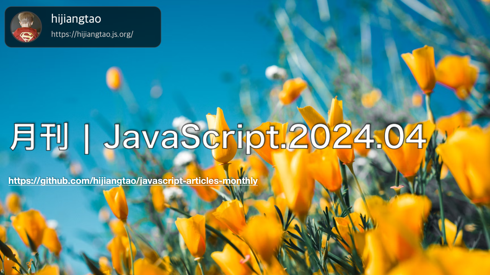

# 月刊 | JavaScript.2024.04

[返回首页](https://github.com/hijiangtao/javascript-articles-monthly)

## 清单

本期话题包含 Promise、Node.js、Web 组件、Angular、Figma、优化技巧、JavaScript 框架模版、Web 发展、Angular 优化等内容。

* [JavaScript 可视化：Promise 的执行](https://www.lydiahallie.com/blog/promise-execution) - 本篇博文深入探讨了JavaScript中Promise的内部工作原理，以及它们如何能够在JavaScript中实现非阻塞异步任务。文章还以 `setTimeout` 为例，通过逐步执行解释了如何利用Promise处理异步操作及其在事件循环中的行为和微任务队列的概念。通过许多实际例子和对于Promises对象的详细分析，帮助读者更好地理解了Promises的工作原理，使它们变得更易于理解和使用。
* [Node.js：纪录片 | 起源故事](https://www.youtube.com/watch?v=LB8KwiiUGy0) - 这段视频讲述了Node.js的起源故事。它回顾了2008年，当时大多数人仅将JavaScript视为客户端语言。但随着Google的V8引擎的出现，年轻的开发者Ryan Dahl意识到了非阻塞服务器、V8与JavaScript的潜在联系。通过结合这些关键元素，他创造了现在广受欢迎的Node.js。视频中，我们可以深入了解Node.js的起源，认识它的一些早期贡献者，并探索使用开源技术的公司与推动其进步的社区成员之间复杂的动态。视频特别采访了Node.js的创造者Ryan Dahl、npm的创造者Isaac Schlueter等人，揭示了Node.js从诞生到成长的历程。
* [Web 组件版权年份更新器](https://gist.github.com/ceving/6e65886e04563ed9e6e42cc5f8d3f656) - 这个Gist包含了一个用于更新版权声明中年份的Web组件的代码。这个组件可以确保你的版权通知中的年份始终保持最新。作者提供了详细的代码示例，展示了如何定义一个扩展自HTMLSpanElement的JavaScript类作为版权年份组件，以及如何在HTML中使用该组件。通过JavaScript的类和自定义元素的定义，用户可以轻松地将这个组件集成到自己的网页中，无需每年手动更新版权年份。
* [Angular 17.3的新特性](https://dev.to/this-is-angular/whats-new-in-angular-173-1148) - 文章讲述了Angular 17.3的新功能和变化。主要更新包括了新的`output()` API用于从组件中发射输出，以及辅助函数`outputFromObservable()`和`outputToObservable()`用于观察者对象到组件输出之间的转换。此外还引入了`hostAttributeToken()`类，用于注入宿主节点的静态属性。文章还指出，Angular 17.3已经支持TypeScript 5.4版本，并探讨了这些更新如何影响开发者的开发流程。
* [如何在 Figma 中推出自定义权限DSL](https://www.figma.com/blog/how-we-rolled-out-our-own-permissions-dsl-at-figma/) - Figma团队分享了他们如何构建一个自定义的权限定义语言（DSL），以解决他们在应用程序中遇到的权限相关的复杂问题。该DSL让开发人员可以更直观地理解和控制对不同部分的访问权限，同时提高了性能、准确性和开发便利性。文章详细介绍了从产生这个需求，到DSL的设计，再到最终实施过程中所遇到的挑战和学到的经验。通过重构他们的权限系统，Figma成功实现了对协作核心功能的改进和扩充。
* [优化 Javascript 的技巧和策略](https://romgrk.com/posts/optimizing-javascript) - 这篇文章提供了针对Javascript性能优化的一系列建议和技巧。作者分享了从基础的比较、避免不必要的工作，到深入的内存管理等不同层面的优化策略，强调了优化前进行基准测试的重要性，并且指出了常见的性能瓶颈和提高代码执行效率的方法。
* [比较 JavaScript 框架第1部分：模板](https://www.maartenhus.nl/blog/comparing-javascript-frameworks-part-1-templates/) - 这篇文章是对现代流行JavaScript框架模板语言的比较，包括Vue.js、React、Angular和Svelte。第一部分重点在于对比这些框架的模板语言，这对于定义应用程序或网站的HTML来说至关重要。作者基于他个人使用这些框架的经验，详细阐述了它们如何使创建动态HTML变得更容易，同时回顾了每个框架的组件定义方式、条件渲染和列表渲染等核心模板特性。整个比较突出了各个框架的不同思路和设计选择，提供了一个全面的视角帮助读者理解这些不同的模板语言如何在构建丰富的Web应用时发挥作用。
* [苹果放弃摧毁 Web 应用程序，但斗争仍在继续](https://open-web-advocacy.org/blog/apple-backs-off-killing-web-apps/) - 文章讲述了苹果公司原计划限制Web应用程序功能以符合欧盟法律的新规定，但在开发者和公众的强烈反对下，苹果取消了这一计划。该决策结束了开发者和用户几周来的恐惧和不确定性。文章详细描述了苹果公司怎样试图暗中通过技术措施破坏Web应用，并且受到如何在社区和媒体上反对的压力，最终被迫撤回这一决定。尽管这是一个重大胜利，文章也指出为了全球范围内公平竞争的浏览器和Web应用，斗争还远未结束。
* [Angular 中延迟视图的打包尺寸改进](https://angularindepth.com/posts/1528/bundle-size-improvements-from-deferred-views-in-angular) - 文章详细介绍了Angular新版本中引入的延迟视图（Deferrable Views）功能，如何通过该技术减少初始包(bundle)大小从而改善应用的加载时间。通过使用defer块和动态导入，开发者可以对组件加载进行细粒度控制，优化应用性能。该文阐述了延迟视图如何工作，以及使用前后应用包尺寸的具体区别。这一特性为开发者提供了一种新的工具，可以显著降低应用的初始化负担，加速页面加载。

## 动态

* [Babylon.js 7.0.0](https://github.com/BabylonJS/Babylon.js/releases/tag/7.0.0)
* [deno v1.42.0](https://github.com/denoland/deno/releases/tag/v1.42.0)
* [Node v20.12.0 (LTS)](https://nodejs.org/en/blog/release/v20.12.0)
* [Angular v17.3.0](https://github.com/angular/angular/releases/tag/17.3.0)
* [D3 7.9](https://d3js.org/)
* [React Native Skia 1.0](https://shopify.github.io/react-native-skia/)
* [TypeScript 5.4](https://devblogs.microsoft.com/typescript/announcing-typescript-5-4/)

