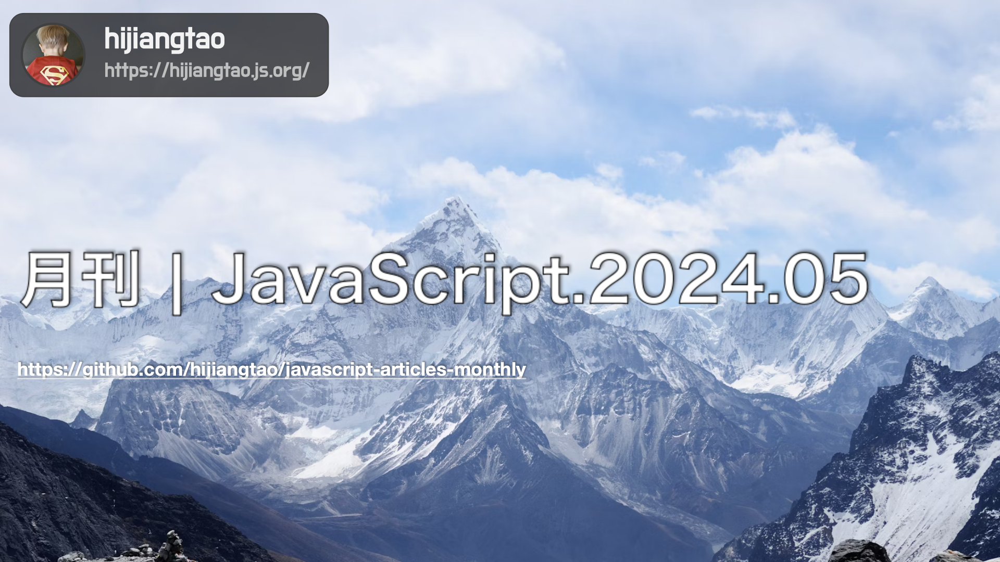

# 月刊 | JavaScript.2024.05

[返回首页](https://github.com/hijiangtao/javascript-articles-monthly)

## 清单

本期话题包含包管理器、jQuery、JSX、TypeScript、Performance、Rspack、开源组件库、JavaScript 提案、V8 沙盒、Svelte、Figma 开发、JavaScript 引擎等内容。

* [JSR不是另一个包管理器](https://deno.com/blog/jsr-is-not-another-package-manager) - 实际上，JSR是为了改善JavaScript和TypeScript在服务器端运行时、浏览器和各种工具之间共享的方式，而设计的一种革命性的注册仓库。它通过简化开发人员长期困扰的复杂性，从根本上改进了代码分发过程。JSR只支持ESM（ECMAScript模块），首先是TypeScript，消除了对`package.json`配置和复杂的`tsconfig`编译选项的挣扎。通过包评分系统，JSR激励了代码分发的最佳实践。JSR是一个注册表，不是npm注册表的另一个客户端，旨在补充而非取代npm注册表，并且JSR包可以依赖于npm包。在Deno中，JSR还提供了出色的安全性特征，所有这些都使JSR不仅仅是生态系统中的另一个工具，而是我们思考分发JavaScript和TypeScript方式的根本转变。
* [升级jQuery：朝着健康的网络前进](https://blog.jquery.com/2024/04/17/upgrading-jquery-working-towards-a-healthy-web/) - 文章讨论了升级jQuery对网络安全、性能和兼容性的重要性。自2006年首次推出以来，jQuery已成为网页开发者的基本工具，简化了JavaScript编程，使得操作HTML文档、处理事件、执行动画等变得更容易。尽管现代JavaScript框架的兴起导致新项目使用jQuery的开发者减少，全球用量仍然极高。jQuery团队和OpenJS基金会正在进行健康网络体检活动，指导开发者理解保持jQuery版本更新的重要性并引导如何升级。向最新版本的升级是保护应用程序受安全漏洞利用风险降低的关键。文章还提供了升级jQuery的具体指南和jQuery Migrate插件的使用方法，使得从旧版本升级到新版变得尽可能容易，并为即将到来的jQuery 4.0版本提出未来指南。
* [快速JSX：不再克隆props对象](https://github.com/facebook/react/pull/28768) - 此次React的更新中，为了提升元素创建效率，决定在JSX中不再默认克隆传入的props对象。在旧式运行时中，出于React内部保留属性如`key`和`ref`的处理，以及`createElement`作为可被手动调用的公共API可能导致的用户空间代码变更，对props对象克隆是必要的。但由于新的JSX运行时仅为编译器目标，并且总是传入全新的内联对象，因此除非`key`是通过展开操作传递至元素，否则就无需克隆。预期此变更会显著提升JSX元素创建的速度，对许多应用来说，这是总体渲染成本中的一个重要部分。
* [用TypeScript和oclif从头构建CLI](https://www.joshcanhelp.com/oclif/) - 本篇博文展示了如何使用TypeScript和oclif工具来构建一个命令行接口（CLI）。文章的作者详细描述了他在构建两个CLI过程中的经验和过程，提供了一步步的教学，指导读者如何从零开始创建CLI。他讨论了采用oclif框架的好处，比如减轻痛苦和避免重复劳动，尽管他最初尝试使用oclif框架时遭遇了困难。文章详细介绍了如何设置项目，编写代码，以及如何执行和测试命令，最终创建一个功能性的CLI。这篇文章是对那些有兴趣使用TypeScript开发CLI的开发者的宝贵资源。
* [使用Performance面板分析Node.js性能](https://developer.chrome.com/docs/devtools/performance/nodejs/) - 这篇文章介绍了如何通过Chrome开发者工具中的Performance面板来分析Node.js应用的性能。文中讲解了什么是CPU性能分析、如何开启Node.js的DevTools、如何记录并分析CPU利用情况，并介绍了通过`console.profile()`命令进行性能分析的方法。性能分析结果可以帮助开发者发现程序中的性能瓶颈，优化代码。具体的步骤包括在命令行中启动Node.js或Deno程序的检测，连接到DevTools，记录性能，以及如何读取和使用各种工具（如Timeline、Bottom-Up、Call Tree、Event Log）来分析性能数据。这些工具为开发者提供了可视化的性能指标，使性能调优更加直观有效。
* [深入探究Rspack和Webpack的树摇晃（Tree Shaking）技术](https://github.com/orgs/web-infra-dev/discussions/17) - 文章主要关注理解Webpack树摇晃（Tree Shaking）的概念，而不深入探讨其背后的代码实现。树摇晃是一种在JavaScript中常用于消除死代码的术语，依赖于ES2015模块语法的静态结构，如import和export。该讨论不专注于树摇晃本身，而是关注类别中的不同代码优化。Webpack树摇晃主要涉及三种优化：usedExports优化，移除模块中未使用的export变量，进一步消除相关无副作用的语句；sideEffects优化，从模块图中移除未使用export变量的模块；以及DCE（死代码消除）优化。这些优化操作的维度不同：usedExports关注export变量，sideEffects关注整个模块，而DCE关注JavaScript语句。文章详细介绍了这些优化的实现和它们之间的相互影响，为理解和适用Webpack树摇晃技术提供了宝贵的指南。
* [使用Wedges快速构建：适用于React的开源UI组件集](https://www.lemonsqueezy.com/wedges) - Wedges是一个专门为React设计的美观实用的开源UI组件库。它整合了Wedges设计系统、Radix UI和Tailwind CSS，提供了一整套优雅的UI组件供开发者使用。这个组件库包括数字输入框、菜单、加载指示器、输入框、图标、下拉列表、国家选择器、复选框、按钮、按钮组、徽章、头像和头像组等多种组件。Wedges把专业设计的Figma设计系统和开源的React UI库结合起来，利用Radix UI原始组件和Tailwind CSS，让开发者可以轻松地构建符合WAI-ARIA标准的、可访问的应用程序。同时，它支持深色模式切换，快捷且自动化地适应用户所需，并提供TypeScript支持，以减少学习曲线，节省宝贵时间。Wedges被设计为易于自定义的，开发者可以快速创建主题，随心所欲地定制组件样式。
* [JavaScript的信号提案](https://github.com/tc39/proposal-signals) - 这篇文章由TC39提案的领导者编写，讨论了JavaScript的信号提案。提案通过引入信号机制，类似于之前Promises/A+的努力，旨在改进应用程序状态的管理，使开发者能够专注于业务逻辑而非重复细节。作者强调，这一提案不仅仅是为了提供一个统一的开发人员界面API，而是为了精确地定义信号图的核心语义，为框架构建提供共同的信号图和自动跟踪机制。提案描述了信号在Web框架中的使用案例，以及如何通过信号简化和自动化数据绑定和状态管理。预期这种信号机制将能够以互操作的方式嵌入不同的框架中，带来实践中的实际益处。
* [V8引擎沙盒：新一代安全机制](https://v8.dev/blog/sandbox) - 介绍了V8引擎的沙盒功能，这是一个轻量级、进程内的沙盒环境，目的是在不影响主进程的情况下隔离和执行不可信的JavaScript和WebAssembly代码。该功能已经不再是一个实验性的安全特性。该博文讨论了沙盒的动机、如何工作、以及为什么它是实现内存安全的一个必要步骤。提到所有在野外捕获的Chrome漏洞都是从Chrome渲染进程中的某个内存破坏漏洞开始的，这通常涉及对V8中发现的漏洞的利用。文章还解释了为什么当前的内存安全技术对于优化JavaScript引擎几乎不起作用——它们不能阻止V8本身的内存破坏。但是，这些技术实际上可以保护V8沙盒的攻击面。因此，沙盒是迈向内存安全的必要步骤，它已被默认启用在Chrome的适配平台上，并通过各种基准测试，表明其性能开销极小。
* [超越React的前端开发：Svelte（1/3）](https://itnext.io/frontend-development-beyond-react-svelte-1-3-f47eda22cba5) - 这篇文章是前端开发系列研究的一部分，专注于研究React之外的前端开发技术，起始篇关注的是Svelte。文章总结了关于Svelte的重要理论和实践知识点。作为一名React开发者，作者尝试在Svelte中寻找已被证明有效的特性，如窗口技术、组件和路由的懒加载、数据和图片的异步加载以及本地资源的动态加载。文章将分享作者在学习过程中掌握的所有知识，并希望这些内容对读者在轻松开始使用Svelte方面有所帮助。建议的内容菜单包括：核心理念指南、实践指南、优化指南以及生态系统指南等多个部分，介绍了特性、生命周期、项目结构、样式复用、数据请求与传递、组件状态、条件渲染、列表、响应声明、响应式状态“Store”、导航、过渡和动画等多个方面，以及如何处理大量数据源、大型应用程序的管理、图片的懒加载和本地文件的异步加载等优化策略。
* [Figma插件开发深度解析](https://macwright.com/2024/03/29/figma-plugins.html) - 这篇文章探讨了在Figma中创建和维护插件的经验，特别是Placemark插件，让用户能够在Figma中创建矢量地图。文章分享了如何使用Observable建立插件监测仪表板、Figma插件围绕安全设计的挑战以及他们是如何成功实现安全沙箱环境的。它还涉及了Figma使用QuickJS作为其沙箱机制的决策背后的情况。作者分析了使用QuickJS导致的调试问题和性能挑战，并反映了他的个人经历，即使插件取得了成功——Placemark插件有1.1万用户，Placemark Globe有1.5千用户——他也不清楚这些用户是否真正在使用它们。此外，文章还涵盖了Figma插件架构的奇特之处，并对前端开发的现状和挑战进行思考，最后分享了作者作为开源插件项目负责人的其他体验和观察。
* [JavaScript引擎中的对象结构](https://blog.frontend-almanac.com/js-object-structure) - 该文章深入探讨了JavaScript引擎中对象是如何存储和处理的，以及开发者的行为是如何影响性能和内存消耗的。它详细讨论了数据属性和访问器属性的区别，以及“隐藏类”这一优化概念，这一概念使得在不同对象间复用元信息和属性成为可能。文章进一步解释了隐藏类的继承，以及属性顺序如何影响隐藏类的形状。作者详细描述了如何在V8引擎中使用内置方法来分析对象结构，并通过实例展示了对象属性在内部和外部存储方面的不同，以及这对性能产生的影响。最后，文章也提到了与数组处理相关的概念，讨论了当数组的属性发生变化时如何影响性能。整篇文章为想要了解背后机理的JavaScript开发者提供了豁然开朗的洞见。

## 动态

* [Electron 30.0.0](https://www.electronjs.org/blog/electron-30-0)
* [React Native 0.74](https://reactnative.dev/blog/2024/04/22/release-0.74)
* [pnpm v9.0.0](https://github.com/pnpm/pnpm/releases/tag/v9.0.0)
* [ESLint v9.0.0](https://eslint.org/blog/2024/04/eslint-v9.0.0-released/)
* [Bun 1.1](https://bun.sh/blog/bun-v1.1)
* [Deno 1.42](https://deno.com/blog/v1.42)
* [Babylon.js 7.0](https://babylonjs.medium.com/introducing-babylon-js-7-0-a141cd7ede0d)
