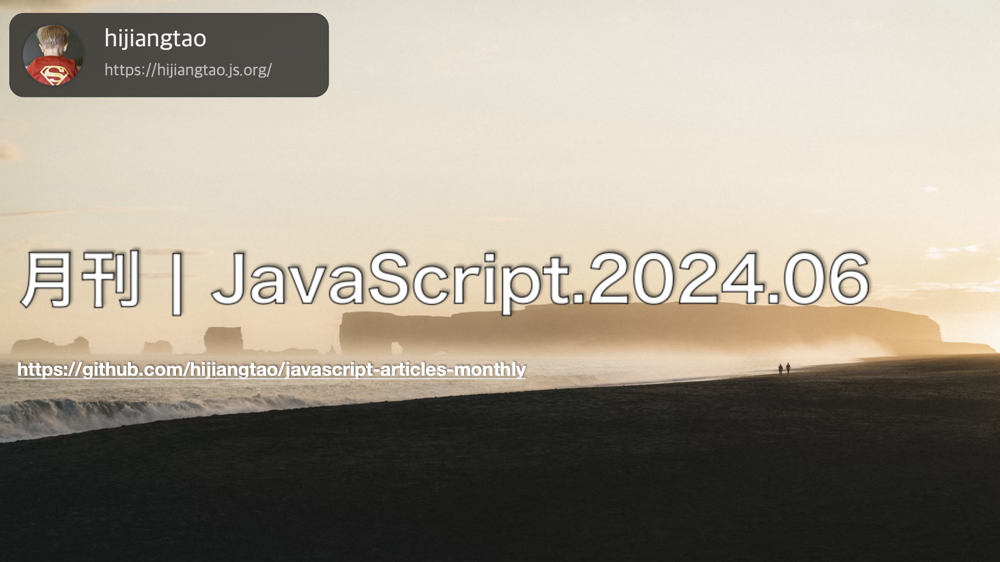

# 月刊 | JavaScript.2024.06

[返回首页](https://github.com/hijiangtao/javascript-articles-monthly)

## 清单

本期话题包含文档生成、ECMAScript、代码格式化、开发前端库、TypeScript、Web API、Angular、esbuild、Node.js 等内容。

* [如何文档化你的 js 包](https://deno.com/blog/document-javascript-package) - 本文介绍了如何为你创建并发布的开源包写文档，以及如何通过各种方式（比如在VSCode中）使文档为你的用户所用。通过JSDoc，可以轻松编写与代码结合在一起的文档，配合像JSR这样的现代发布流程，你可以为你的包创建全面的文档。这篇博客旨在讲述编写JSDoc注释的最佳实践，以便用户能够尽快地上手。
* [ECMAScript提案：Promise.withResolvers()](https://2ality.com/2024/05/proposal-promise-with-resolvers.html) - 这篇博文审视了ECMAScript 2024特性“Promise.withResolvers”（由Peter Klecha提出），它提供了直接创建Promise的新方法，作为new Promise(...)的替代方案。文章详细介绍了reveal构造器模式和Promise.withResolvers()使用案例，还包含了如何通过该提案实现的API将基于回调函数的方法改写成基于Promise的方法的示例，此外，文中还探讨了一些常见问题的回答，以及为什么选用“resolvers”并不是“settlers”这样的术语。
* [实现我的手写代码](https://www.amygoodchild.com/blog/cursive-handwriting-in-javascript) - 这篇文章描述了作者如何将她的手写字转变成一种可以在JavaScript中使用的字体风格。她首先创建了一个块状脚本（block script），最初她认为草书（cursive）太复杂了，但最终她还是制作了草书版本。文章详细阐述了设计字母、定义关键路径点，并将它们使用Chaikin曲线算法平滑化的过程。此外，作者分享了创建可变粗细字母形状的步骤，并通过p5.js绘制形状路径。她还探讨了将代码化字母与实际的笔迹进行比较的结果，并考虑了关于文件大小与详细程度之间的平衡。
* [在400行代码内构建你自己的React.js](https://webdeveloper.beehiiv.com/p/build-react-400-lines-code) - 这篇文章深入研究了React的原理，并指导读者如何使用大约400行代码来创建一个支持异步更新和可中断的简版React，这是React的核心功能，许多高级API都依赖它。文章解释了Fiber架构和并发模式的工作原理，以及如何使用requestIdleCallback等API划分工作单元优化性能，提升用户界面的响应速度。作者还提供了详细的代码示例和在线实现链接，尽管目前的实现只支持一次性渲染JSX，不处理状态更新，但它为理解React的工作原理奠定了基础。
* [Figma迁移到TypeScript的历程](https://www.figma.com/blog/figmas-journey-to-typescript-compiling-away-our-custom-programming-language) - 文章描述了Figma在移动引擎上从使用内部开发的定制编程语言Skew转变为使用TypeScript的过程。Skew最初是为了提高Figma原型查看器在Web和移动端上的性能而创建的，但随着代码量的增加，Skew带来的维护困难和缺乏外部开发者生态系统的支持变得日益明显。Figma团队最终决定迁移到业界标准语言TypeScript，这使得代码整合、工具使用和新人培训等方面大为改善。文章详细解释了迁移过程，包括初期的技术挑战和如何最终实现平滑过渡。
* [let & const](https://www.epicweb.dev/talks/let-me-be) - 如何在不过度坚持变量声明规则的情况下提升代码质量。Ryan Florence探究了JavaScript的演变，特别是对ES6特性const的分析。他讨论了let和const关键词对JavaScript实践的影响，并对编码社区内引起的辩论进行了深入讨论。文章分析了围绕const关键词的误解，强调其作为常量而不是变量的作用，并说明使用const并不意味着内容不可变。演讲最后挑战观众扩大对JavaScript语言特性及其应用的理解，并强调应把焦点放在用户体验而不是严格的编码规则上。
* [Angular v18 新特性速览](https://blog.angular.dev/angular-v18-is-now-available-e79d5ac0affe) - Angular团队分享了Angular的最新里程碑。在过去的几次更新中，他们推出了许多新特性和改进。这一次，他们专注于完善已发布的工作，将许多新的API转为稳定状态，并且实验性地推出了社区期待已久的项目之一：无区域变化检测（zoneless change detection）。这次更新的亮点包括无区域变化检测的实验性支持、Angular.dev成为Angular开发者的新家园、Material 3、可延迟的视图、内置的控制流现已稳定且经过了一系列改进、服务端渲染的改善如 i18n hydration支持、更好的调试、在Angular Material中的hydration支持以及事件重放。
* [1Password如何使用esbuild缩短浏览器扩展构建时间](https://blog.1password.com/new-extension-build-system/) - 1Password的浏览器扩展构建系统在五年间逐渐变慢，影响了工作效率。作者通过分析现有构建系统，发现Webpack和Rollup的运行时间长，且存在许多小的依赖项需要单独构建。他们尝试了多种方法来改善这一状况，最终发现直接使用esbuild替代Webpack/Rollup能大幅减少构建时间。在黑客松活动中，团队利用esbuild重建了大部分系统，并在活动结束后继续完善，解决了类型检查、生产构建测试等问题。新构建系统将扩展构建时间减少了70%，生产实现进一步减少了超过90%，显著提升了开发效率。此外，新系统还带来了更快的监视模式和更好的诊断格式化。
* [ECMAScript 2023特性：Symbols作为WeakMap的键](https://2ality.com/2024/05/proposal-symbols-as-weakmap-keys.html) - 这篇文章探讨了ECMAScript 2023提案中的一个特性"Symbols作为WeakMap的键"，讨论了WeakMaps的优势、与普通Map的差异、可以作为WeakMaps键的值类型，以及为何注册的symbols（通过Symbol.for()创建的）不被允许作为WeakMap的键。文章还讨论了symbols作为WeakMap键的有趣之处，例如在记录和元组中包含对象的引用，以及在晦涩难懂的域（ShadowRealms）中传递对象引用。此特性为js未来的新特型提供了重要的支持，并在尾部提供了一些相关阅读资料和链接。
* [你应该在 2024 年开始使用的10个现代 Node.js 运行时功能](https://snyk.io/blog/10-modern-node-js-runtime-features/) - 这篇文章介绍了 10 个现代 Node.js 运行时功能，可以帮助开发人员提高开发效率、增强应用程序性能并加强安全性。

## 动态

* [Astro 4.9](https://astro.build/blog/astro-490/)
* [Rspack v0.7](https://www.rspack.dev/blog/announcing-0-7)
* [Storybook 8.1](https://storybook.js.org/blog/storybook-8-1/)
* [Deno 1.44](https://deno.com/blog/v1.44)
* [ESLint v9.3.0](https://eslint.org/blog/2024/05/eslint-v9.3.0-released/)
* [React 19 RC](https://react.dev/blog/2024/04/25/react-19)
* [Next.js 15 RC](https://nextjs.org/blog/next-15-rc)
