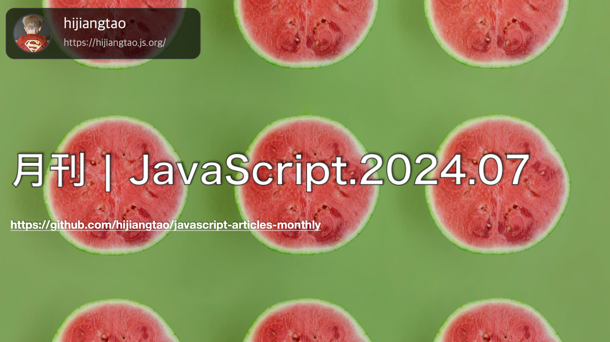

# 月刊 | JavaScript.2024.07

[返回首页](https://github.com/hijiangtao/javascript-articles-monthly)

## 清单

本期话题包含 React、Promise、SPA、年度总结、模块体验、ECMAScript、Web API 等内容。

* [深入了解 React 编译器](https://www.developerway.com/posts/i-tried-react-compiler) - 这篇文章深入探讨了React编译器（React Compiler）的功能、性能以及它如何改变了React应用中的渲染优化方式。作者通过一系列实验和案例分析，展示了编译器的实际效果，并讨论了它在实际开发中的应用和挑战。
* [JavaScript 中的 Promises - 从入门到精通](https://www.joshwcomeau.com/javascript/promises/) - 这篇文章介绍了JavaScript中的Promises，强调了理解Promises对于JavaScript开发者的重要性，并提供了从基础知识到深入理解的全面指导。
* [单页应用中的数据获取模式](https://martinfowler.com/articles/data-fetch-spa.html) - 这篇文章讨论了单页应用程序中数据获取的模式。文章首先指出，现代应用通常会为单个页面发送数百个请求，以改善性能和用户体验。接着，文章介绍了异步状态处理模式、备用标记、避免请求瀑布和实现并行数据获取等策略，以优化数据获取过程。文章还讨论了代码拆分、基于用户交互预取数据等高级概念，并通过实例展示了如何在前端应用中实现这些模式。
* [State of JS 2023 结果公布](https://2023.stateofjs.com/en-US) - 这篇文章提供了对JavaScript 2023状态的深入分析，讨论了其发展速度、未来趋势以及开发者如何应对这种快速的变化。文章由Sacha Greif撰写，他认为JavaScript的发展速度并未放缓，反而在多个领域出现了创新。作者建议开发者可以根据自己的需求和兴趣选择适合自己的发展方向，无论是追求最新的技术趋势还是保持稳定的技术发展。
* [JavaScript 在模块体验方向的重大进展](https://thenewstack.io/how-javascript-is-finally-improving-the-module-experience/) - 这篇文章讨论了JavaScript模块体验的改进，特别是ECMAScript模块（ESM）的发展，以及被称为“模块和谐”的一系列提案如何旨在填补ESM与之前的CommonJS模块系统之间的功能差距。
* [ECMAScript 2024 新增内容概览](https://2ality.com/2024/06/ecmascript-2024.html)
* [重新了解 JavaScript 中的 Set 方法](https://developer.mozilla.org/en-US/blog/javascript-set-methods/) - 文章介绍了JavaScript中新的Set方法，这些方法在Firefox 127及之后的大多数主要浏览器引擎中都可用，无需polyfill即可在所有地方工作。文章向新手展示了如何使用这些新方法，并通过基本示例强调了使用这些方法的优点，而不是自己构建实现。文章还通过示例解释了这些方法的使用，强调了Set数据结构的唯一性优势，以及如何通过这些方法进行集合运算，例如并集、交集、对称差集和差集等。

## 动态

* [Bun v1.1.16](https://bun.sh/blog/bun-v1.1.16)
* [electron v31.1.0](https://github.com/electron/electron/releases/tag/v31.1.0)
* [Astro 4.11](https://astro.build/blog/astro-4110/)
* [Node v20.15.0 (LTS)](https://nodejs.org/en/blog/release/v20.15.0)
* [TypeScript 5.5](https://devblogs.microsoft.com/typescript/announcing-typescript-5-5/)
